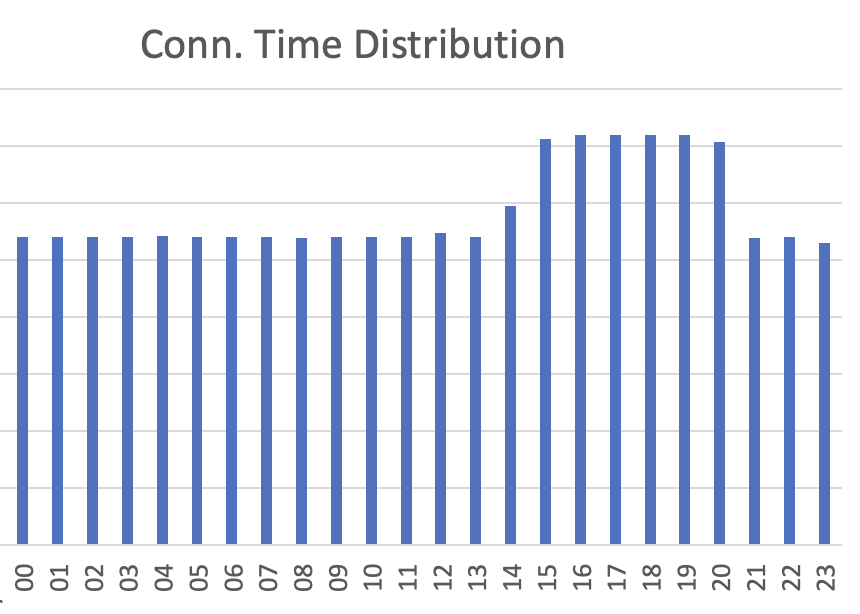

+++
date = '2025-09-06T19:03:00-04:00'
draft = false
title = 'Analyzing Firewall Logs'
tags = ['Understanding Networks', 'firewalls']
+++

UFW - the Uncomplicated FireWall - is a default and welcome feature in most Linux distros. The purpose of a firewall, put simply, is to block unwanted requests and connections into your computer.

What isn't as obvious is just how many of these requests bombard a server on any given day. This reality becomes clear when we look at the logs that UFW quietly and dilligently puts out, night and day, chronicling the nefarious visitors.

As part of the Understanding Networks class, I set up a VPS through DigitalOcean (a basic 1GB machine, running Ubuntu). After some basic provisioning steps, like locking down access to just SSH keys, moving away from the root user, setting up Caddy and a Hugo repo to run my class blogs, etc., I let the VPS rest for a couple of days.

What's nice about UFW is that it'll consistently log connection attempts into a file at `/var/logs/ufw.log`. This allows us to do a rudimentary Firewall analysis on connections made to our server. This is what a single connection attempt looks like inside the `ufw.log` file:

```
2025-09-06T20:56:10.850852+00:00 itpnetworks kernel: [UFW BLOCK] IN=eth0 OUT= MAC=32:cc:1f:83:84:fc:fe:00:00:00:01:01:08:00 SRC=206.123.145.21 DST=157.245.90.47 LEN=52 TOS=0x08 PREC=0x20 TTL=51 ID=10726 PROTO=TCP SPT=38353 DPT=15035 WINDOW=65535 RES=0x00 SYN URGP=0
```

Of note are the `SRC`, `DPT` (Destination Port), and `PROTO` (which except for a few logs is always TCP).

While we could run an analysis as-is, using just this information, I decided to inject some more details using `IPInfo.io`'s API. To do so, and to then turn the file into a usable CSV, I wrote a basic Python script.

The core of it is the log Class, which gets populated with all the existing and API-sourced fields:

```python
class LogEntry:
    def __init__(self, timestamp, interface_in, mac, src_ip, dst_ip, length, tos, prec, ttl, id, proto, src_port, dst_port, window, res, urgp):
        self.timestamp = timestamp
        self.interface_in = interface_in
        self.mac = mac
        self.src_ip = src_ip
        self.dst_ip = dst_ip
        self.length = length
        self.tos = tos
        self.prec = prec
        self.ttl = ttl
        self.id = id
        self.proto = proto
        self.src_port = src_port
        self.dst_port = dst_port
        self.window = window
        self.res = res
        self.urgp = urgp
        self.continent = "N/A"
        self.country = "N/A"
        self.asn = "N/A"
        self.as_name = "N/A"
        self.as_domain = "N/A"
```

Each log item then gets injected with information we receive from a call to IPInfo.io. Doing it this way allows us to tie information to all **14,709** connection attempts we received in the three days the server was up.

We first prune the list so as to not submit duplicate id's, this gets us to about **2,000** IP's to submit to the API:
```python
# Create pruned log_entry list with only unique entries in order to not overload IPinfo.io API.
unique_log_entries = []
for log in logList:
    if log.src_ip not in [entry.src_ip for entry in unique_log_entries]:
        unique_log_entries.append(log)
print(f"Reduced to {len(unique_log_entries)} unique log entries based on source IP.")
```

We then make the call, and set a (maybe too conservative) 1-2 random seconds between request so as to not hit any sort of rate-limiting with the API.

```python
# For each log entry, add datapoints provided by IPinfo.io using their API, and my Token f16eb2292770cb
print("Enriching log entries with IPinfo.io data...")
for log in unique_log_entries:
    # Make a request to the IPinfo.io API
    response = requests.get(f"https://api.ipinfo.io/lite/{log.src_ip}?token=f16eb2292770cb")
    print(f"Requesting data for IP {log.src_ip}, status code: {response.status_code}")
    if response.status_code == 200:
        data = response.json()
        print(data)
        log.continent = data.get("continent", "N/A")
        log.country = data.get("country", "N/A")
        log.asn = data.get("asn", "N/A")
        log.as_name = data.get("as_name", "N/A")
        log.as_domain = data.get("as_domain", "N/A")
        print(f"Enriched log for IP {log.src_ip}: {log.continent}, {log.country}, {log.asn}, {log.as_name}, {log.as_domain}")
    else:
        print(f"Failed to retrieve data for IP {log.src_ip}, status code: {response.status_code}")
        log.continent = "N/A"
        log.country = "N/A"
        log.asn = "N/A"
        log.as_name = "N/A"
        log.as_domain = "N/A"
    # To avoid hitting the rate limit, add a delay of 1-2 second between requests
    time.sleep(random.uniform(1, 2))
```

This populates every IP from our logs with the following fields: **Continent**, **Country**, **ASN** (Autonomous System Number), **AS NAME**, **AS DOMAIN**.

By then moving all of this info into Excel, we can count all occurrences of a given IP, Country, etc. The results are quite interesting, especially the outliers.

**Most Frequent Ports** *(I've added a description of each port's main purpose)*

<table border="0" cellpadding="0" cellspacing="0" width="365" style="">
  <thead>
    <tr height="21" style="height: 16pt;">
      <th>30303</th>
      <th>7426</th>
      <th>Ethereum Client Port</th>
    </tr>
  </thead><colgroup><col width="79" style="width: 59pt;"><col width="69" style="width: 52pt;"><col width="217" style="width: 163pt;"></colgroup>
  <tbody>
    <tr height="21" style="height: 16pt;">
      <td height="21" align="right" style="padding-top: 1px; padding-right: 1px; padding-left: 1px; color: black; font-size: 12pt; font-family: Calibri, sans-serif; vertical-align: bottom; border: none; text-wrap-mode: nowrap; height: 16pt;">53</td>
      <td align="right" style="padding-top: 1px; padding-right: 1px; padding-left: 1px; color: black; font-size: 12pt; font-family: Calibri, sans-serif; vertical-align: bottom; border: none; text-wrap-mode: nowrap;">571</td>
      <td style="padding-top: 1px; padding-right: 1px; padding-left: 1px; color: black; font-size: 12pt; font-family: Calibri, sans-serif; vertical-align: bottom; border: none; text-wrap-mode: nowrap;">DNS Port (DDoS)</td>
    </tr>
    <tr height="21" style="height: 16pt;">
      <td height="21" align="right" style="padding-top: 1px; padding-right: 1px; padding-left: 1px; color: black; font-size: 12pt; font-family: Calibri, sans-serif; vertical-align: bottom; border: none; text-wrap-mode: nowrap; height: 16pt;">23</td>
      <td align="right" style="padding-top: 1px; padding-right: 1px; padding-left: 1px; color: black; font-size: 12pt; font-family: Calibri, sans-serif; vertical-align: bottom; border: none; text-wrap-mode: nowrap;">156</td>
      <td style="padding-top: 1px; padding-right: 1px; padding-left: 1px; color: black; font-size: 12pt; font-family: Calibri, sans-serif; vertical-align: bottom; border: none; text-wrap-mode: nowrap;">Telnet port (uname+pass brutef)</td>
    </tr>
    <tr height="21" style="height: 16pt;">
      <td height="21" align="right" style="padding-top: 1px; padding-right: 1px; padding-left: 1px; color: black; font-size: 12pt; font-family: Calibri, sans-serif; vertical-align: bottom; border: none; text-wrap-mode: nowrap; height: 16pt;">8080</td>
      <td align="right" style="padding-top: 1px; padding-right: 1px; padding-left: 1px; color: black; font-size: 12pt; font-family: Calibri, sans-serif; vertical-align: bottom; border: none; text-wrap-mode: nowrap;">65</td>
      <td style="padding-top: 1px; padding-right: 1px; padding-left: 1px; color: black; font-size: 12pt; font-family: Calibri, sans-serif; vertical-align: bottom; border: none; text-wrap-mode: nowrap;">HTTP alt / DDoS, CORS</td>
    </tr>
    <tr height="21" style="height: 16pt;">
      <td height="21" align="right" style="padding-top: 1px; padding-right: 1px; padding-left: 1px; color: black; font-size: 12pt; font-family: Calibri, sans-serif; vertical-align: bottom; border: none; text-wrap-mode: nowrap; height: 16pt;">8728</td>
      <td align="right" style="padding-top: 1px; padding-right: 1px; padding-left: 1px; color: black; font-size: 12pt; font-family: Calibri, sans-serif; vertical-align: bottom; border: none; text-wrap-mode: nowrap;">58</td>
      <td style="padding-top: 1px; padding-right: 1px; padding-left: 1px; color: black; font-size: 12pt; font-family: Calibri, sans-serif; vertical-align: bottom; border: none; text-wrap-mode: nowrap;">Mikrotik router vuln., botnet&nbsp;</td>
    </tr>
    <tr height="21" style="height: 16pt;">
      <td height="21" align="right" style="padding-top: 1px; padding-right: 1px; padding-left: 1px; color: black; font-size: 12pt; font-family: Calibri, sans-serif; vertical-align: bottom; border: none; text-wrap-mode: nowrap; height: 16pt;">37215</td>
      <td align="right" style="padding-top: 1px; padding-right: 1px; padding-left: 1px; color: black; font-size: 12pt; font-family: Calibri, sans-serif; vertical-align: bottom; border: none; text-wrap-mode: nowrap;">57</td>
      <td style="padding-top: 1px; padding-right: 1px; padding-left: 1px; color: black; font-size: 12pt; font-family: Calibri, sans-serif; vertical-align: bottom; border: none; text-wrap-mode: nowrap;">Huawei router, DDoS capture</td>
    </tr>
    <tr height="21" style="height: 16pt;">
      <td height="21" align="right" style="padding-top: 1px; padding-right: 1px; padding-left: 1px; color: black; font-size: 12pt; font-family: Calibri, sans-serif; vertical-align: bottom; border: none; text-wrap-mode: nowrap; height: 16pt;">5900</td>
      <td align="right" style="padding-top: 1px; padding-right: 1px; padding-left: 1px; color: black; font-size: 12pt; font-family: Calibri, sans-serif; vertical-align: bottom; border: none; text-wrap-mode: nowrap;">48</td>
      <td style="padding-top: 1px; padding-right: 1px; padding-left: 1px; color: black; font-size: 12pt; font-family: Calibri, sans-serif; vertical-align: bottom; border: none; text-wrap-mode: nowrap;">VNC protocol, UPnP req. vuln</td>
    </tr>
    <tr height="21" style="height: 16pt;">
      <td height="21" align="right" style="padding-top: 1px; padding-right: 1px; padding-left: 1px; color: black; font-size: 12pt; font-family: Calibri, sans-serif; vertical-align: bottom; border: none; text-wrap-mode: nowrap; height: 16pt;">80</td>
      <td align="right" style="padding-top: 1px; padding-right: 1px; padding-left: 1px; color: black; font-size: 12pt; font-family: Calibri, sans-serif; vertical-align: bottom; border: none; text-wrap-mode: nowrap;">41</td>
      <td style="padding-top: 1px; padding-right: 1px; padding-left: 1px; color: black; font-size: 12pt; font-family: Calibri, sans-serif; vertical-align: bottom; border: none; text-wrap-mode: nowrap;">HTTP port</td>
    </tr>
    <tr height="21" style="height: 16pt;">
      <td height="21" align="right" style="padding-top: 1px; padding-right: 1px; padding-left: 1px; color: black; font-size: 12pt; font-family: Calibri, sans-serif; vertical-align: bottom; border: none; text-wrap-mode: nowrap; height: 16pt;">3128</td>
      <td align="right" style="padding-top: 1px; padding-right: 1px; padding-left: 1px; color: black; font-size: 12pt; font-family: Calibri, sans-serif; vertical-align: bottom; border: none; text-wrap-mode: nowrap;">32</td>
      <td style="padding-top: 1px; padding-right: 1px; padding-left: 1px; color: black; font-size: 12pt; font-family: Calibri, sans-serif; vertical-align: bottom; border: none; text-wrap-mode: nowrap;">Proxy server (squid), encr. vuln</td>
    </tr>
    <tr height="21" style="height: 16pt;">
      <td height="21" align="right" style="padding-top: 1px; padding-right: 1px; padding-left: 1px; color: black; font-size: 12pt; font-family: Calibri, sans-serif; vertical-align: bottom; border: none; text-wrap-mode: nowrap; height: 16pt;">443</td>
      <td align="right" style="padding-top: 1px; padding-right: 1px; padding-left: 1px; color: black; font-size: 12pt; font-family: Calibri, sans-serif; vertical-align: bottom; border: none; text-wrap-mode: nowrap;">30</td>
      <td style="padding-top: 1px; padding-right: 1px; padding-left: 1px; color: black; font-size: 12pt; font-family: Calibri, sans-serif; vertical-align: bottom; border: none; text-wrap-mode: nowrap;">HTTPS port</td>
    </tr>
  </tbody>
</table>

**Most Frequent Countries**

<table border="0" cellpadding="0" cellspacing="0" width="207" style="">
  <thead>
    <tr height="21" style="height: 16pt;">
      <th>United States</th>
      <th>3493</th>
    </tr>
  </thead><colgroup><col width="120" style="width: 90pt;"><col width="87" style="width: 65pt;"></colgroup>
  <tbody>
    <tr height="21" style="height: 16pt;">
      <td height="21" style="padding-top: 1px; padding-right: 1px; padding-left: 1px; color: black; font-size: 12pt; font-family: Calibri, sans-serif; vertical-align: bottom; border: none; text-wrap-mode: nowrap; height: 16pt;">Germany</td>
      <td align="right" style="padding-top: 1px; padding-right: 1px; padding-left: 1px; color: black; font-size: 12pt; font-family: Calibri, sans-serif; vertical-align: bottom; border: none; text-wrap-mode: nowrap;">3163</td>
    </tr>
    <tr height="21" style="height: 16pt;">
      <td height="21" style="padding-top: 1px; padding-right: 1px; padding-left: 1px; color: black; font-size: 12pt; font-family: Calibri, sans-serif; vertical-align: bottom; border: none; text-wrap-mode: nowrap; height: 16pt;">The Netherlands</td>
      <td align="right" style="padding-top: 1px; padding-right: 1px; padding-left: 1px; color: black; font-size: 12pt; font-family: Calibri, sans-serif; vertical-align: bottom; border: none; text-wrap-mode: nowrap;">1842</td>
    </tr>
    <tr height="21" style="height: 16pt;">
      <td height="21" style="padding-top: 1px; padding-right: 1px; padding-left: 1px; color: black; font-size: 12pt; font-family: Calibri, sans-serif; vertical-align: bottom; border: none; text-wrap-mode: nowrap; height: 16pt;">Ireland</td>
      <td align="right" style="padding-top: 1px; padding-right: 1px; padding-left: 1px; color: black; font-size: 12pt; font-family: Calibri, sans-serif; vertical-align: bottom; border: none; text-wrap-mode: nowrap;">1557</td>
    </tr>
    <tr height="21" style="height: 16pt;">
      <td height="21" style="padding-top: 1px; padding-right: 1px; padding-left: 1px; color: black; font-size: 12pt; font-family: Calibri, sans-serif; vertical-align: bottom; border: none; text-wrap-mode: nowrap; height: 16pt;">United Kingdom</td>
      <td align="right" style="padding-top: 1px; padding-right: 1px; padding-left: 1px; color: black; font-size: 12pt; font-family: Calibri, sans-serif; vertical-align: bottom; border: none; text-wrap-mode: nowrap;">1264</td>
    </tr>
    <tr height="21" style="height: 16pt;">
      <td height="21" style="padding-top: 1px; padding-right: 1px; padding-left: 1px; color: black; font-size: 12pt; font-family: Calibri, sans-serif; vertical-align: bottom; border: none; text-wrap-mode: nowrap; height: 16pt;">Hong Kong</td>
      <td align="right" style="padding-top: 1px; padding-right: 1px; padding-left: 1px; color: black; font-size: 12pt; font-family: Calibri, sans-serif; vertical-align: bottom; border: none; text-wrap-mode: nowrap;">921</td>
    </tr>
    <tr height="21" style="height: 16pt;">
      <td height="21" style="padding-top: 1px; padding-right: 1px; padding-left: 1px; color: black; font-size: 12pt; font-family: Calibri, sans-serif; vertical-align: bottom; border: none; text-wrap-mode: nowrap; height: 16pt;">Japan</td>
      <td align="right" style="padding-top: 1px; padding-right: 1px; padding-left: 1px; color: black; font-size: 12pt; font-family: Calibri, sans-serif; vertical-align: bottom; border: none; text-wrap-mode: nowrap;">613</td>
    </tr>
    <tr height="21" style="height: 16pt;">
      <td height="21" style="padding-top: 1px; padding-right: 1px; padding-left: 1px; color: black; font-size: 12pt; font-family: Calibri, sans-serif; vertical-align: bottom; border: none; text-wrap-mode: nowrap; height: 16pt;">France</td>
      <td align="right" style="padding-top: 1px; padding-right: 1px; padding-left: 1px; color: black; font-size: 12pt; font-family: Calibri, sans-serif; vertical-align: bottom; border: none; text-wrap-mode: nowrap;">196</td>
    </tr>
    <tr height="21" style="height: 16pt;">
      <td height="21" style="padding-top: 1px; padding-right: 1px; padding-left: 1px; color: black; font-size: 12pt; font-family: Calibri, sans-serif; vertical-align: bottom; border: none; text-wrap-mode: nowrap; height: 16pt;">China</td>
      <td align="right" style="padding-top: 1px; padding-right: 1px; padding-left: 1px; color: black; font-size: 12pt; font-family: Calibri, sans-serif; vertical-align: bottom; border: none; text-wrap-mode: nowrap;">98</td>
    </tr>
    <tr height="21" style="height: 16pt;">
      <td height="21" style="padding-top: 1px; padding-right: 1px; padding-left: 1px; color: black; font-size: 12pt; font-family: Calibri, sans-serif; vertical-align: bottom; border: none; text-wrap-mode: nowrap; height: 16pt;">Finland</td>
      <td align="right" style="padding-top: 1px; padding-right: 1px; padding-left: 1px; color: black; font-size: 12pt; font-family: Calibri, sans-serif; vertical-align: bottom; border: none; text-wrap-mode: nowrap;">95</td>
    </tr>
    <tr height="21" style="height: 16pt;">
      <td height="21" style="padding-top: 1px; padding-right: 1px; padding-left: 1px; color: black; font-size: 12pt; font-family: Calibri, sans-serif; vertical-align: bottom; border: none; text-wrap-mode: nowrap; height: 16pt;">Bulgaria</td>
      <td align="right" style="padding-top: 1px; padding-right: 1px; padding-left: 1px; color: black; font-size: 12pt; font-family: Calibri, sans-serif; vertical-align: bottom; border: none; text-wrap-mode: nowrap;">79</td>
    </tr>
    <tr height="21" style="height: 16pt;">
      <td height="21" style="padding-top: 1px; padding-right: 1px; padding-left: 1px; color: black; font-size: 12pt; font-family: Calibri, sans-serif; vertical-align: bottom; border: none; text-wrap-mode: nowrap; height: 16pt;">Canada</td>
      <td align="right" style="padding-top: 1px; padding-right: 1px; padding-left: 1px; color: black; font-size: 12pt; font-family: Calibri, sans-serif; vertical-align: bottom; border: none; text-wrap-mode: nowrap;">79</td>
    </tr>
    <tr height="21" style="height: 16pt;">
      <td height="21" style="padding-top: 1px; padding-right: 1px; padding-left: 1px; color: black; font-size: 12pt; font-family: Calibri, sans-serif; vertical-align: bottom; border: none; text-wrap-mode: nowrap; height: 16pt;">Singapore</td>
      <td align="right" style="padding-top: 1px; padding-right: 1px; padding-left: 1px; color: black; font-size: 12pt; font-family: Calibri, sans-serif; vertical-align: bottom; border: none; text-wrap-mode: nowrap;">78</td>
    </tr>
    <tr height="21" style="height: 16pt;">
      <td height="21" style="padding-top: 1px; padding-right: 1px; padding-left: 1px; color: black; font-size: 12pt; font-family: Calibri, sans-serif; vertical-align: bottom; border: none; text-wrap-mode: nowrap; height: 16pt;">Russia</td>
      <td align="right" style="padding-top: 1px; padding-right: 1px; padding-left: 1px; color: black; font-size: 12pt; font-family: Calibri, sans-serif; vertical-align: bottom; border: none; text-wrap-mode: nowrap;">69</td>
    </tr>
    <tr height="21" style="height: 16pt;">
      <td height="21" style="padding-top: 1px; padding-right: 1px; padding-left: 1px; color: black; font-size: 12pt; font-family: Calibri, sans-serif; vertical-align: bottom; border: none; text-wrap-mode: nowrap; height: 16pt;">Taiwan</td>
      <td align="right" style="padding-top: 1px; padding-right: 1px; padding-left: 1px; color: black; font-size: 12pt; font-family: Calibri, sans-serif; vertical-align: bottom; border: none; text-wrap-mode: nowrap;">58</td>
    </tr>
  </tbody>
</table>

**Most Frequent Providers**

<table border="0" cellpadding="0" cellspacing="0" width="440" style="">=
  <thead>
    <tr height="21" style="height: 16pt;">
      <th>Amazon.com, Inc.</th>
      <th>6995</th>
    </tr>
  </thead><colgroup><col width="371" style="width: 278pt;"><col width="69" style="width: 52pt;"></colgroup>
  <tbody>
    <tr height="21" style="height: 16pt;">
      <td height="21" style="padding-top: 1px; padding-right: 1px; padding-left: 1px; color: black; font-size: 12pt; font-family: Calibri, sans-serif; vertical-align: bottom; border: none; text-wrap-mode: nowrap; height: 16pt;">cheapy.host LLC</td>
      <td align="right" style="padding-top: 1px; padding-right: 1px; padding-left: 1px; color: black; font-size: 12pt; font-family: Calibri, sans-serif; vertical-align: bottom; border: none; text-wrap-mode: nowrap;">986</td>
    </tr>
    <tr height="21" style="height: 16pt;">
      <td height="21" style="padding-top: 1px; padding-right: 1px; padding-left: 1px; color: black; font-size: 12pt; font-family: Calibri, sans-serif; vertical-align: bottom; border: none; text-wrap-mode: nowrap; height: 16pt;">Google LLC</td>
      <td align="right" style="padding-top: 1px; padding-right: 1px; padding-left: 1px; color: black; font-size: 12pt; font-family: Calibri, sans-serif; vertical-align: bottom; border: none; text-wrap-mode: nowrap;">706</td>
    </tr>
    <tr height="21" style="height: 16pt;">
      <td height="21" style="padding-top: 1px; padding-right: 1px; padding-left: 1px; color: black; font-size: 12pt; font-family: Calibri, sans-serif; vertical-align: bottom; border: none; text-wrap-mode: nowrap; height: 16pt;">OVH SAS</td>
      <td align="right" style="padding-top: 1px; padding-right: 1px; padding-left: 1px; color: black; font-size: 12pt; font-family: Calibri, sans-serif; vertical-align: bottom; border: none; text-wrap-mode: nowrap;">606</td>
    </tr>
    <tr height="21" style="height: 16pt;">
      <td height="21" style="padding-top: 1px; padding-right: 1px; padding-left: 1px; color: black; font-size: 12pt; font-family: Calibri, sans-serif; vertical-align: bottom; border: none; text-wrap-mode: nowrap; height: 16pt;">TELCHAK GOLD VENTURES (PRIVATE) LIMITED</td>
      <td align="right" style="padding-top: 1px; padding-right: 1px; padding-left: 1px; color: black; font-size: 12pt; font-family: Calibri, sans-serif; vertical-align: bottom; border: none; text-wrap-mode: nowrap;">533</td>
    </tr>
    <tr height="21" style="height: 16pt;">
      <td height="21" style="padding-top: 1px; padding-right: 1px; padding-left: 1px; color: black; font-size: 12pt; font-family: Calibri, sans-serif; vertical-align: bottom; border: none; text-wrap-mode: nowrap; height: 16pt;">Akamai Connected Cloud</td>
      <td align="right" style="padding-top: 1px; padding-right: 1px; padding-left: 1px; color: black; font-size: 12pt; font-family: Calibri, sans-serif; vertical-align: bottom; border: none; text-wrap-mode: nowrap;">509</td>
    </tr>
    <tr height="21" style="height: 16pt;">
      <td height="21" style="padding-top: 1px; padding-right: 1px; padding-left: 1px; color: black; font-size: 12pt; font-family: Calibri, sans-serif; vertical-align: bottom; border: none; text-wrap-mode: nowrap; height: 16pt;">Censys, Inc.</td>
      <td align="right" style="padding-top: 1px; padding-right: 1px; padding-left: 1px; color: black; font-size: 12pt; font-family: Calibri, sans-serif; vertical-align: bottom; border: none; text-wrap-mode: nowrap;">491</td>
    </tr>
    <tr height="21" style="height: 16pt;">
      <td height="21" style="padding-top: 1px; padding-right: 1px; padding-left: 1px; color: black; font-size: 12pt; font-family: Calibri, sans-serif; vertical-align: bottom; border: none; text-wrap-mode: nowrap; height: 16pt;">DigitalOcean, LLC</td>
      <td align="right" style="padding-top: 1px; padding-right: 1px; padding-left: 1px; color: black; font-size: 12pt; font-family: Calibri, sans-serif; vertical-align: bottom; border: none; text-wrap-mode: nowrap;">285</td>
    </tr>
    <tr height="21" style="height: 16pt;">
      <td height="21" style="padding-top: 1px; padding-right: 1px; padding-left: 1px; color: black; font-size: 12pt; font-family: Calibri, sans-serif; vertical-align: bottom; border: none; text-wrap-mode: nowrap; height: 16pt;">UCLOUD INFORMATION TECHNOLOGY (HK) LIMITED</td>
      <td align="right" style="padding-top: 1px; padding-right: 1px; padding-left: 1px; color: black; font-size: 12pt; font-family: Calibri, sans-serif; vertical-align: bottom; border: none; text-wrap-mode: nowrap;">210</td>
    </tr>
    <tr height="21" style="height: 16pt;">
      <td height="21" style="padding-top: 1px; padding-right: 1px; padding-left: 1px; color: black; font-size: 12pt; font-family: Calibri, sans-serif; vertical-align: bottom; border: none; text-wrap-mode: nowrap; height: 16pt;">IP Volume inc</td>
      <td align="right" style="padding-top: 1px; padding-right: 1px; padding-left: 1px; color: black; font-size: 12pt; font-family: Calibri, sans-serif; vertical-align: bottom; border: none; text-wrap-mode: nowrap;">191</td>
    </tr>
    <tr height="21" style="height: 16pt;">
      <td height="21" style="padding-top: 1px; padding-right: 1px; padding-left: 1px; color: black; font-size: 12pt; font-family: Calibri, sans-serif; vertical-align: bottom; border: none; text-wrap-mode: nowrap; height: 16pt;">ONYPHE SAS</td>
      <td align="right" style="padding-top: 1px; padding-right: 1px; padding-left: 1px; color: black; font-size: 12pt; font-family: Calibri, sans-serif; vertical-align: bottom; border: none; text-wrap-mode: nowrap;">170</td>
    </tr>
    <tr height="21" style="height: 16pt;">
      <td height="21" style="padding-top: 1px; padding-right: 1px; padding-left: 1px; color: black; font-size: 12pt; font-family: Calibri, sans-serif; vertical-align: bottom; border: none; text-wrap-mode: nowrap; height: 16pt;">Microsoft Corporation</td>
      <td align="right" style="padding-top: 1px; padding-right: 1px; padding-left: 1px; color: black; font-size: 12pt; font-family: Calibri, sans-serif; vertical-align: bottom; border: none; text-wrap-mode: nowrap;">164</td>
    </tr>
    <tr height="21" style="height: 16pt;">
      <td height="21" style="padding-top: 1px; padding-right: 1px; padding-left: 1px; color: black; font-size: 12pt; font-family: Calibri, sans-serif; vertical-align: bottom; border: none; text-wrap-mode: nowrap; height: 16pt;">Hurricane Electric LLC</td>
      <td align="right" style="padding-top: 1px; padding-right: 1px; padding-left: 1px; color: black; font-size: 12pt; font-family: Calibri, sans-serif; vertical-align: bottom; border: none; text-wrap-mode: nowrap;">156</td>
    </tr>
    <tr height="21" style="height: 16pt;">
      <td height="21" style="padding-top: 1px; padding-right: 1px; padding-left: 1px; color: black; font-size: 12pt; font-family: Calibri, sans-serif; vertical-align: bottom; border: none; text-wrap-mode: nowrap; height: 16pt;">Nybula LLC</td>
      <td align="right" style="padding-top: 1px; padding-right: 1px; padding-left: 1px; color: black; font-size: 12pt; font-family: Calibri, sans-serif; vertical-align: bottom; border: none; text-wrap-mode: nowrap;">137</td>
    </tr>
    <tr height="21" style="height: 16pt;">
      <td height="21" style="padding-top: 1px; padding-right: 1px; padding-left: 1px; color: black; font-size: 12pt; font-family: Calibri, sans-serif; vertical-align: bottom; border: none; text-wrap-mode: nowrap; height: 16pt;">SKYNET NETWORK LTD</td>
      <td align="right" style="padding-top: 1px; padding-right: 1px; padding-left: 1px; color: black; font-size: 12pt; font-family: Calibri, sans-serif; vertical-align: bottom; border: none; text-wrap-mode: nowrap;">109</td>
    </tr>
  </tbody>
</table>

**Most Frequent Domains**

<table border="0" cellpadding="0" cellspacing="0" width="440" style="">
  <thead>
    <tr height="21" style="height: 16pt;">
      <th>amazon.com</th>
      <th>6995</th>
    </tr>
  </thead><colgroup><col width="353" style="width: 265pt;"><col width="87" style="width: 65pt;"></colgroup>
  <tbody>
    <tr height="21" style="height: 16pt;">
      <td height="21" style="padding-top: 1px; padding-right: 1px; padding-left: 1px; color: black; font-size: 12pt; font-family: Calibri, sans-serif; vertical-align: bottom; border: none; text-wrap-mode: nowrap; height: 16pt;">cheapy.host</td>
      <td align="right" style="padding-top: 1px; padding-right: 1px; padding-left: 1px; color: black; font-size: 12pt; font-family: Calibri, sans-serif; vertical-align: bottom; border: none; text-wrap-mode: nowrap;">986</td>
    </tr>
    <tr height="21" style="height: 16pt;">
      <td height="21" style="padding-top: 1px; padding-right: 1px; padding-left: 1px; color: black; font-size: 12pt; font-family: Calibri, sans-serif; vertical-align: bottom; border: none; text-wrap-mode: nowrap; height: 16pt;">google.com</td>
      <td align="right" style="padding-top: 1px; padding-right: 1px; padding-left: 1px; color: black; font-size: 12pt; font-family: Calibri, sans-serif; vertical-align: bottom; border: none; text-wrap-mode: nowrap;">706</td>
    </tr>
    <tr height="21" style="height: 16pt;">
      <td height="21" style="padding-top: 1px; padding-right: 1px; padding-left: 1px; color: black; font-size: 12pt; font-family: Calibri, sans-serif; vertical-align: bottom; border: none; text-wrap-mode: nowrap; height: 16pt;">ovhcloud.com</td>
      <td align="right" style="padding-top: 1px; padding-right: 1px; padding-left: 1px; color: black; font-size: 12pt; font-family: Calibri, sans-serif; vertical-align: bottom; border: none; text-wrap-mode: nowrap;">606</td>
    </tr>
    <tr height="21" style="height: 16pt;">
      <td height="21" style="padding-top: 1px; padding-right: 1px; padding-left: 1px; color: black; font-size: 12pt; font-family: Calibri, sans-serif; vertical-align: bottom; border: none; text-wrap-mode: nowrap; height: 16pt;">telchakgoldventuresprivatelimitedinternational.xyz</td>
      <td align="right" style="padding-top: 1px; padding-right: 1px; padding-left: 1px; color: black; font-size: 12pt; font-family: Calibri, sans-serif; vertical-align: bottom; border: none; text-wrap-mode: nowrap;">533</td>
    </tr>
    <tr height="21" style="height: 16pt;">
      <td height="21" style="padding-top: 1px; padding-right: 1px; padding-left: 1px; color: black; font-size: 12pt; font-family: Calibri, sans-serif; vertical-align: bottom; border: none; text-wrap-mode: nowrap; height: 16pt;">linode.com</td>
      <td align="right" style="padding-top: 1px; padding-right: 1px; padding-left: 1px; color: black; font-size: 12pt; font-family: Calibri, sans-serif; vertical-align: bottom; border: none; text-wrap-mode: nowrap;">509</td>
    </tr>
    <tr height="21" style="height: 16pt;">
      <td height="21" style="padding-top: 1px; padding-right: 1px; padding-left: 1px; color: black; font-size: 12pt; font-family: Calibri, sans-serif; vertical-align: bottom; border: none; text-wrap-mode: nowrap; height: 16pt;">censys.io</td>
      <td align="right" style="padding-top: 1px; padding-right: 1px; padding-left: 1px; color: black; font-size: 12pt; font-family: Calibri, sans-serif; vertical-align: bottom; border: none; text-wrap-mode: nowrap;">491</td>
    </tr>
    <tr height="21" style="height: 16pt;">
      <td height="21" style="padding-top: 1px; padding-right: 1px; padding-left: 1px; color: black; font-size: 12pt; font-family: Calibri, sans-serif; vertical-align: bottom; border: none; text-wrap-mode: nowrap; height: 16pt;">digitalocean.com</td>
      <td align="right" style="padding-top: 1px; padding-right: 1px; padding-left: 1px; color: black; font-size: 12pt; font-family: Calibri, sans-serif; vertical-align: bottom; border: none; text-wrap-mode: nowrap;">285</td>
    </tr>
    <tr height="21" style="height: 16pt;">
      <td height="21" style="padding-top: 1px; padding-right: 1px; padding-left: 1px; color: black; font-size: 12pt; font-family: Calibri, sans-serif; vertical-align: bottom; border: none; text-wrap-mode: nowrap; height: 16pt;">N/A</td>
      <td align="right" style="padding-top: 1px; padding-right: 1px; padding-left: 1px; color: black; font-size: 12pt; font-family: Calibri, sans-serif; vertical-align: bottom; border: none; text-wrap-mode: nowrap;">218</td>
    </tr>
    <tr height="21" style="height: 16pt;">
      <td height="21" style="padding-top: 1px; padding-right: 1px; padding-left: 1px; color: black; font-size: 12pt; font-family: Calibri, sans-serif; vertical-align: bottom; border: none; text-wrap-mode: nowrap; height: 16pt;">ucloud.cn</td>
      <td align="right" style="padding-top: 1px; padding-right: 1px; padding-left: 1px; color: black; font-size: 12pt; font-family: Calibri, sans-serif; vertical-align: bottom; border: none; text-wrap-mode: nowrap;">210</td>
    </tr>
    <tr height="21" style="height: 16pt;">
      <td height="21" style="padding-top: 1px; padding-right: 1px; padding-left: 1px; color: black; font-size: 12pt; font-family: Calibri, sans-serif; vertical-align: bottom; border: none; text-wrap-mode: nowrap; height: 16pt;">ipvolume.net</td>
      <td align="right" style="padding-top: 1px; padding-right: 1px; padding-left: 1px; color: black; font-size: 12pt; font-family: Calibri, sans-serif; vertical-align: bottom; border: none; text-wrap-mode: nowrap;">191</td>
    </tr>
    <tr height="21" style="height: 16pt;">
      <td height="21" style="padding-top: 1px; padding-right: 1px; padding-left: 1px; color: black; font-size: 12pt; font-family: Calibri, sans-serif; vertical-align: bottom; border: none; text-wrap-mode: nowrap; height: 16pt;">onyphe.io</td>
      <td align="right" style="padding-top: 1px; padding-right: 1px; padding-left: 1px; color: black; font-size: 12pt; font-family: Calibri, sans-serif; vertical-align: bottom; border: none; text-wrap-mode: nowrap;">170</td>
    </tr>
    <tr height="21" style="height: 16pt;">
      <td height="21" style="padding-top: 1px; padding-right: 1px; padding-left: 1px; color: black; font-size: 12pt; font-family: Calibri, sans-serif; vertical-align: bottom; border: none; text-wrap-mode: nowrap; height: 16pt;">microsoft.com</td>
      <td align="right" style="padding-top: 1px; padding-right: 1px; padding-left: 1px; color: black; font-size: 12pt; font-family: Calibri, sans-serif; vertical-align: bottom; border: none; text-wrap-mode: nowrap;">164</td>
    </tr>
    <tr height="21" style="height: 16pt;">
      <td height="21" style="padding-top: 1px; padding-right: 1px; padding-left: 1px; color: black; font-size: 12pt; font-family: Calibri, sans-serif; vertical-align: bottom; border: none; text-wrap-mode: nowrap; height: 16pt;">he.net</td>
      <td align="right" style="padding-top: 1px; padding-right: 1px; padding-left: 1px; color: black; font-size: 12pt; font-family: Calibri, sans-serif; vertical-align: bottom; border: none; text-wrap-mode: nowrap;">156</td>
    </tr>
    <tr height="21" style="height: 16pt;">
      <td height="21" style="padding-top: 1px; padding-right: 1px; padding-left: 1px; color: black; font-size: 12pt; font-family: Calibri, sans-serif; vertical-align: bottom; border: none; text-wrap-mode: nowrap; height: 16pt;">nybula.com</td>
      <td align="right" style="padding-top: 1px; padding-right: 1px; padding-left: 1px; color: black; font-size: 12pt; font-family: Calibri, sans-serif; vertical-align: bottom; border: none; text-wrap-mode: nowrap;">137</td>
    </tr>
  </tbody>
</table>

And finally, **Most Frequent IP's**

<table border="0" cellpadding="0" cellspacing="0" width="235" style="">
  <thead>
    <tr height="21" style="height: 16pt;">
      <th>18.175.136.85</th>
      <th>966</th>
    </tr>
  </thead><colgroup><col width="148" style="width: 111pt;"><col width="87" style="width: 65pt;"></colgroup>
  <tbody>
    <tr height="21" style="height: 16pt;">
      <td height="21" style="padding-top: 1px; padding-right: 1px; padding-left: 1px; color: black; font-size: 12pt; font-family: Calibri, sans-serif; vertical-align: bottom; border: none; text-wrap-mode: nowrap; height: 16pt;">52.213.121.14</td>
      <td align="right" style="padding-top: 1px; padding-right: 1px; padding-left: 1px; color: black; font-size: 12pt; font-family: Calibri, sans-serif; vertical-align: bottom; border: none; text-wrap-mode: nowrap;">946</td>
    </tr>
    <tr height="21" style="height: 16pt;">
      <td height="21" style="padding-top: 1px; padding-right: 1px; padding-left: 1px; color: black; font-size: 12pt; font-family: Calibri, sans-serif; vertical-align: bottom; border: none; text-wrap-mode: nowrap; height: 16pt;">18.162.120.131</td>
      <td align="right" style="padding-top: 1px; padding-right: 1px; padding-left: 1px; color: black; font-size: 12pt; font-family: Calibri, sans-serif; vertical-align: bottom; border: none; text-wrap-mode: nowrap;">791</td>
    </tr>
    <tr height="21" style="height: 16pt;">
      <td height="21" style="padding-top: 1px; padding-right: 1px; padding-left: 1px; color: black; font-size: 12pt; font-family: Calibri, sans-serif; vertical-align: bottom; border: none; text-wrap-mode: nowrap; height: 16pt;">3.70.55.65</td>
      <td align="right" style="padding-top: 1px; padding-right: 1px; padding-left: 1px; color: black; font-size: 12pt; font-family: Calibri, sans-serif; vertical-align: bottom; border: none; text-wrap-mode: nowrap;">746</td>
    </tr>
    <tr height="21" style="height: 16pt;">
      <td height="21" style="padding-top: 1px; padding-right: 1px; padding-left: 1px; color: black; font-size: 12pt; font-family: Calibri, sans-serif; vertical-align: bottom; border: none; text-wrap-mode: nowrap; height: 16pt;">54.234.104.125</td>
      <td align="right" style="padding-top: 1px; padding-right: 1px; padding-left: 1px; color: black; font-size: 12pt; font-family: Calibri, sans-serif; vertical-align: bottom; border: none; text-wrap-mode: nowrap;">705</td>
    </tr>
    <tr height="21" style="height: 16pt;">
      <td height="21" style="padding-top: 1px; padding-right: 1px; padding-left: 1px; color: black; font-size: 12pt; font-family: Calibri, sans-serif; vertical-align: bottom; border: none; text-wrap-mode: nowrap; height: 16pt;">63.176.22.69</td>
      <td align="right" style="padding-top: 1px; padding-right: 1px; padding-left: 1px; color: black; font-size: 12pt; font-family: Calibri, sans-serif; vertical-align: bottom; border: none; text-wrap-mode: nowrap;">696</td>
    </tr>
    <tr height="21" style="height: 16pt;">
      <td height="21" style="padding-top: 1px; padding-right: 1px; padding-left: 1px; color: black; font-size: 12pt; font-family: Calibri, sans-serif; vertical-align: bottom; border: none; text-wrap-mode: nowrap; height: 16pt;">3.68.53.133</td>
      <td align="right" style="padding-top: 1px; padding-right: 1px; padding-left: 1px; color: black; font-size: 12pt; font-family: Calibri, sans-serif; vertical-align: bottom; border: none; text-wrap-mode: nowrap;">690</td>
    </tr>
    <tr height="21" style="height: 16pt;">
      <td height="21" style="padding-top: 1px; padding-right: 1px; padding-left: 1px; color: black; font-size: 12pt; font-family: Calibri, sans-serif; vertical-align: bottom; border: none; text-wrap-mode: nowrap; height: 16pt;">54.78.131.68</td>
      <td align="right" style="padding-top: 1px; padding-right: 1px; padding-left: 1px; color: black; font-size: 12pt; font-family: Calibri, sans-serif; vertical-align: bottom; border: none; text-wrap-mode: nowrap;">608</td>
    </tr>
    <tr height="21" style="height: 16pt;">
      <td height="21" style="padding-top: 1px; padding-right: 1px; padding-left: 1px; color: black; font-size: 12pt; font-family: Calibri, sans-serif; vertical-align: bottom; border: none; text-wrap-mode: nowrap; height: 16pt;">135.148.168.151</td>
      <td align="right" style="padding-top: 1px; padding-right: 1px; padding-left: 1px; color: black; font-size: 12pt; font-family: Calibri, sans-serif; vertical-align: bottom; border: none; text-wrap-mode: nowrap;">579</td>
    </tr>
    <tr height="21" style="height: 16pt;">
      <td height="21" style="padding-top: 1px; padding-right: 1px; padding-left: 1px; color: black; font-size: 12pt; font-family: Calibri, sans-serif; vertical-align: bottom; border: none; text-wrap-mode: nowrap; height: 16pt;">3.115.23.90</td>
      <td align="right" style="padding-top: 1px; padding-right: 1px; padding-left: 1px; color: black; font-size: 12pt; font-family: Calibri, sans-serif; vertical-align: bottom; border: none; text-wrap-mode: nowrap;">516</td>
    </tr>
    <tr height="21" style="height: 16pt;">
      <td height="21" style="padding-top: 1px; padding-right: 1px; padding-left: 1px; color: black; font-size: 12pt; font-family: Calibri, sans-serif; vertical-align: bottom; border: none; text-wrap-mode: nowrap; height: 16pt;">63.176.157.198</td>
      <td align="right" style="padding-top: 1px; padding-right: 1px; padding-left: 1px; color: black; font-size: 12pt; font-family: Calibri, sans-serif; vertical-align: bottom; border: none; text-wrap-mode: nowrap;">138</td>
    </tr>
    <tr height="21" style="height: 16pt;">
      <td height="21" style="padding-top: 1px; padding-right: 1px; padding-left: 1px; color: black; font-size: 12pt; font-family: Calibri, sans-serif; vertical-align: bottom; border: none; text-wrap-mode: nowrap; height: 16pt;">196.251.69.91</td>
      <td align="right" style="padding-top: 1px; padding-right: 1px; padding-left: 1px; color: black; font-size: 12pt; font-family: Calibri, sans-serif; vertical-align: bottom; border: none; text-wrap-mode: nowrap;">109</td>
    </tr>
    <tr height="21" style="height: 16pt;">
      <td height="21" style="padding-top: 1px; padding-right: 1px; padding-left: 1px; color: black; font-size: 12pt; font-family: Calibri, sans-serif; vertical-align: bottom; border: none; text-wrap-mode: nowrap; height: 16pt;">196.251.83.215</td>
      <td align="right" style="padding-top: 1px; padding-right: 1px; padding-left: 1px; color: black; font-size: 12pt; font-family: Calibri, sans-serif; vertical-align: bottom; border: none; text-wrap-mode: nowrap;">107</td>
    </tr>
    <tr height="21" style="height: 16pt;">
      <td height="21" style="padding-top: 1px; padding-right: 1px; padding-left: 1px; color: black; font-size: 12pt; font-family: Calibri, sans-serif; vertical-align: bottom; border: none; text-wrap-mode: nowrap; height: 16pt;">196.251.87.74</td>
      <td align="right" style="padding-top: 1px; padding-right: 1px; padding-left: 1px; color: black; font-size: 12pt; font-family: Calibri, sans-serif; vertical-align: bottom; border: none; text-wrap-mode: nowrap;">103</td>
    </tr>
    <tr height="21" style="height: 16pt;">
      <td height="21" style="padding-top: 1px; padding-right: 1px; padding-left: 1px; color: black; font-size: 12pt; font-family: Calibri, sans-serif; vertical-align: bottom; border: none; text-wrap-mode: nowrap; height: 16pt;">206.123.145.4</td>
      <td align="right" style="padding-top: 1px; padding-right: 1px; padding-left: 1px; color: black; font-size: 12pt; font-family: Calibri, sans-serif; vertical-align: bottom; border: none; text-wrap-mode: nowrap;">100</td>
    </tr>
  </tbody>
</table>

We can also look at the most frequent times of attempted connections. We do this by, again, counting all the hours at which the attempted connections were made, and drawing a (horrible, please forgive) distribution chart of the most common times. Interestingly, these happen to be from 14:00 - 20:00.

