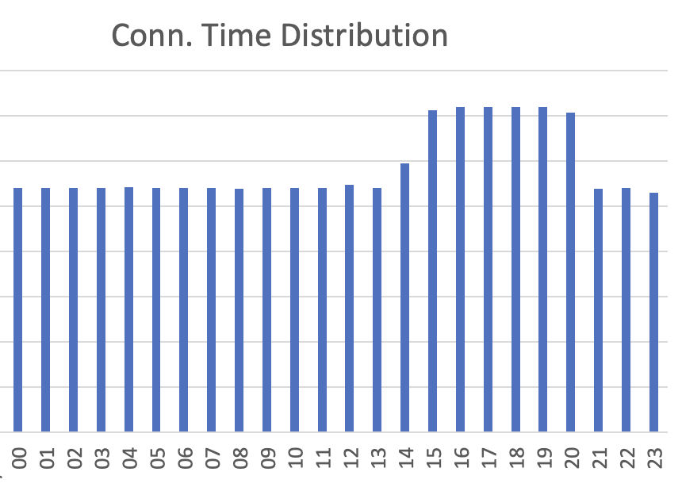

+++
date = '2025-09-06T19:03:00-04:00'
draft = false
title = 'Analyzing Firewall Logs'
tags = ['Understanding Networks', 'firewalls']
+++

UFW - the Uncomplicated FireWall - is a default and welcome feature in most Linux distros. The purpose of a firewall, put simply, is to block unwanted requests and connections into your computer.


What isn't as obvious is just how many of these requests bombard a server on any given day. This reality becomes clear when we look at the logs that UFW quietly and dilligently puts out, night and day, chronicling the nefarious visitors.


As part of the Understanding Networks class, I set up a VPS through DigitalOcean (a basic 1GB machine, running Ubuntu). After some basic provisioning steps, like locking down access to just SSH keys, moving away from the root user, setting up Caddy and a Hugo repo to run my class blogs, etc., I let the VPS rest for a couple of days.


What's nice about UFW is that it'll consistently log connection attempts into a file at `/var/logs/ufw.log`. This allows us to do a rudimentary Firewall analysis on connections made to our server. This is what a single connection attempt looks like inside the `ufw.log` file:

```
2025-09-06T20:56:10.850852+00:00 itpnetworks kernel: [UFW BLOCK] IN=eth0 OUT= MAC=32:cc:1f:83:84:fc:fe:00:00:00:01:01:08:00 SRC=206.123.145.21 DST=157.245.90.47 LEN=52 TOS=0x08 PREC=0x20 TTL=51 ID=10726 PROTO=TCP SPT=38353 DPT=15035 WINDOW=65535 RES=0x00 SYN URGP=0
```


Of note are the `SRC`, `DPT` (Destination Port), and `PROTO` (which except for a few logs is always TCP).


While we could run an analysis as-is, using just this information, I decided to inject some more details using `IPInfo.io`'s API. To do so, and to then turn the file into a usable CSV, I wrote a basic Python script.


The core of it is the log Class, which gets populated with all the existing and API-sourced fields:

```python
class LogEntry:
    def __init__(self, timestamp, interface_in, mac, src_ip, dst_ip, length, tos, prec, ttl, id, proto, src_port, dst_port, window, res, urgp):
        self.timestamp = timestamp
        self.interface_in = interface_in
        self.mac = mac
        self.src_ip = src_ip
        self.dst_ip = dst_ip
        self.length = length
        self.tos = tos
        self.prec = prec
        self.ttl = ttl
        self.id = id
        self.proto = proto
        self.src_port = src_port
        self.dst_port = dst_port
        self.window = window
        self.res = res
        self.urgp = urgp
        self.continent = "N/A"
        self.country = "N/A"
        self.asn = "N/A"
        self.as_name = "N/A"
        self.as_domain = "N/A"
```


Each log item then gets injected with information we receive from a call to IPInfo.io. Doing it this way allows us to tie information to all **14,709** connection attempts we received in the three days the server was up.


We first prune the list so as to not submit duplicate id's, this gets us to about **2,000** IP's to submit to the API:

```python
# Create pruned log_entry list with only unique entries in order to not overload IPinfo.io API.
unique_log_entries = []
for log in logList:
    if log.src_ip not in [entry.src_ip for entry in unique_log_entries]:
        unique_log_entries.append(log)
print(f"Reduced to {len(unique_log_entries)} unique log entries based on source IP.")
```


We then make the call, and set a (maybe too conservative) 1-2 random seconds between request so as to not hit any sort of rate-limiting with the API.

```python
# For each log entry, add datapoints provided by IPinfo.io using their API, and my Token f16eb2292770cb
print("Enriching log entries with IPinfo.io data...")
for log in unique_log_entries:
    # Make a request to the IPinfo.io API
    response = requests.get(f"https://api.ipinfo.io/lite/{log.src_ip}?token=f16eb2292770cb")
    print(f"Requesting data for IP {log.src_ip}, status code: {response.status_code}")
    if response.status_code == 200:
        data = response.json()
        print(data)
        log.continent = data.get("continent", "N/A")
        log.country = data.get("country", "N/A")
        log.asn = data.get("asn", "N/A")
        log.as_name = data.get("as_name", "N/A")
        log.as_domain = data.get("as_domain", "N/A")
        print(f"Enriched log for IP {log.src_ip}: {log.continent}, {log.country}, {log.asn}, {log.as_name}, {log.as_domain}")
    else:
        print(f"Failed to retrieve data for IP {log.src_ip}, status code: {response.status_code}")
        log.continent = "N/A"
        log.country = "N/A"
        log.asn = "N/A"
        log.as_name = "N/A"
        log.as_domain = "N/A"
    # To avoid hitting the rate limit, add a delay of 1-2 second between requests
    time.sleep(random.uniform(1, 2))
```


This populates every IP from our logs with the following fields: **Continent**, **Country**, **ASN** (Autonomous System Number), **AS NAME**, **AS DOMAIN**.


By then moving all of this info into Excel, we can count all occurrences of a given IP, Country, etc. The results are quite interesting, especially the outliers.


**Most Frequent Ports** *(I've added a description of each port's main purpose)*

| Port | Count | Description |
| ---: | ---: | --- |
| 30303 | 7426 | Ethereum Client port |
| 53 | 571 | DNS Port (DDoS) |
| 23 | 156 | Telnet port (uname+pass brutef) |
| 8080 | 65 | HTTP alt / DDoS, CORS |
| 8728 | 58 | Mikrotik router vuln., botnet |
| 37215 | 57 | Huawei router, DDoS capture |
| 5900 | 48 | VNC protocol, UPnP req. vuln |
| 80 | 41 | HTTP port |
| 3128 | 32 | Proxy server (squid), encr. vuln |
| 443 | 30 | HTTPS port |


**Most Frequent Countries**

| Country | Count |
| --- | ---: |
| United States | 3493 |
| Germany | 3163 |
| The Netherlands | 1842 |
| Ireland | 1557 |
| United Kingdom | 1264 |
| Hong Kong | 921 |
| Japan | 613 |
| France | 196 |
| China | 98 |
| Finland | 95 |
| Bulgaria | 79 |
| Canada | 79 |
| Singapore | 78 |
| Russia | 69 |
| Taiwan | 58 |


**Most Frequent Providers**

| Provider | Count |
| --- | ---: |
| Amazon.com, Inc. | 6995 |
| cheapy.host LLC | 986 |
| Google LLC | 706 |
| OVH SAS | 606 |
| TELCHAK GOLD VENTURES (PRIVATE) LIMITED | 533 |
| Akamai Connected Cloud | 509 |
| Censys, Inc. | 491 |
| DigitalOcean, LLC | 285 |
| UCLOUD INFORMATION TECHNOLOGY (HK) LIMITED | 210 |
| IP Volume inc | 191 |
| ONYPHE SAS | 170 |
| Microsoft Corporation | 164 |
| Hurricane Electric LLC | 156 |
| Nybula LLC | 137 |
| SKYNET NETWORK LTD | 109 |


**Most Frequent Domains**

| Domain | Count |
| --- | ---: |
| amazon.com | 6995 |
| cheapy.host | 986 |
| google.com | 706 |
| ovhcloud.com | 606 |
| telchakgoldventuresprivatelimitedinternational.xyz | 533 |
| linode.com | 509 |
| censys.io | 491 |
| digitalocean.com | 285 |
| N/A | 218 |
| ucloud.cn | 210 |
| ipvolume.net | 191 |
| onyphe.io | 170 |
| microsoft.com | 164 |
| he.net | 156 |
| nybula.com | 137 |


And finally, **Most Frequent IP's**

| IP | Count |
| --- | ---: |
| 18.175.136.85 | 966 |
| 52.213.121.14 | 946 |
| 18.162.120.131 | 791 |
| 3.70.55.65 | 746 |
| 54.234.104.125 | 705 |
| 63.176.22.69 | 696 |
| 3.68.53.133 | 690 |
| 54.78.131.68 | 608 |
| 135.148.168.151 | 579 |
| 3.115.23.90 | 516 |
| 63.176.157.198 | 138 |
| 196.251.69.91 | 109 |
| 196.251.83.215 | 107 |
| 196.251.87.74 | 103 |
| 206.123.145.4 | 100 |


We can also look at the most frequent times of attempted connections. We do this by, again, counting all the hours at which the attempted connections were made, and drawing a (horrible, please forgive) distribution chart of the most common times. Interestingly, these happen to be from 14:00 - 20:00.

