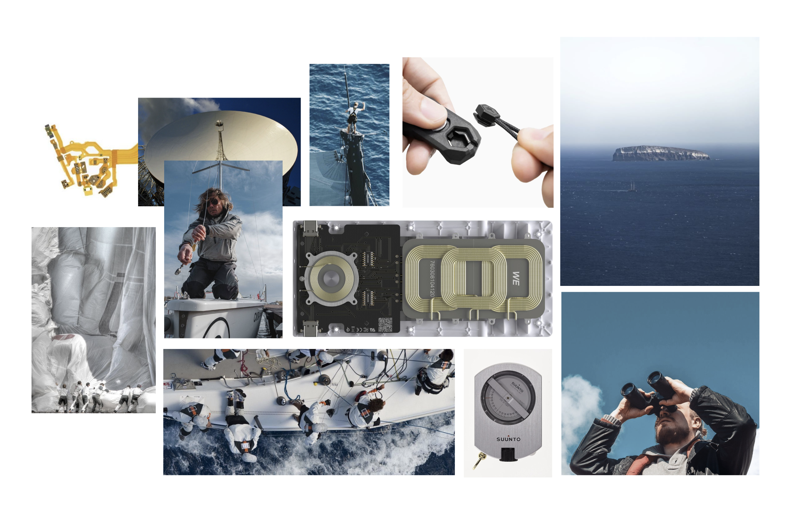
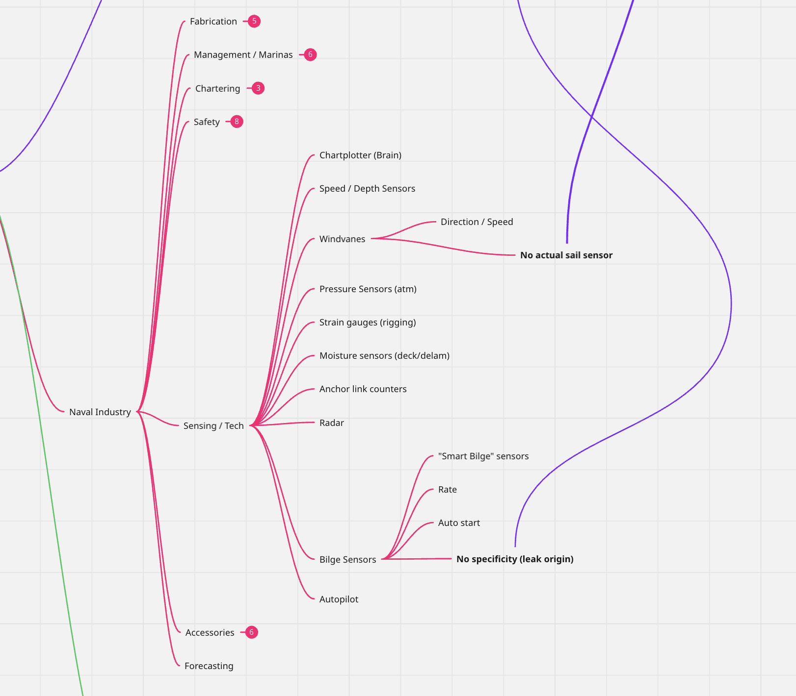

+++
date = '2025-09-14T18:03:50-04:00'
draft = false
title = 'Beyond Initial Ideation'
tags = ['Project Development']
+++

I've been mulling over some more specific project ideas over the past week. While I'm pretty sure of what I'm going for already, it has been helpful to begin constraining it to a more strict framework. That said, I'm also at odds with the idea of retroactively fitting everything into its specific box - in many ways, I feel design frameworks often skew closer to "art" frameworks, in that they imbue projects with a significant level of abstraction and conceptual baggage. Granted, I'm saying this in part because my idea feels like a purely technical answer to a purely technical problem; it might actually be worth trying to dig a bit deeper into why this interests me at all (beyond the precariousness of an F1, and trying to make something tangible from my experience in this program).

In looking at the naval industry as a whole, I think there's two significant gaps in the existence of applicable sensors and sensing technologies: anything to do with sails, and anything to do with leaks (which you think would've already been addressed, given the thousands of years we've been doing this). I think these areas are ripe for exploration, especially when we consider the unprecedented availability of very-low-power MCU's and peripheral modules which allow for easy and discrete systems that are easily integrated into existing ship structures.

## Topic & Attribute

### Topic

I've been thinking a lot about the idea of environmental sensing as it applies to human needs. There's a sort of cyberpunk-esque reality that I feel was never fulfilled, where sensors embedded in our built world provided us with highly useful information on a constant basis: not on a "scientific" level (i.e. pollution levels, or rain qty), but rather on a smaller, more local and immediate level. 

Therefore, I think for the time-being I'm sticking with the topic of **Sensory Amplification** in a naval setting.

### Attribute

I've also recently been obsessed by the idea of power, namely low-power and how new devices are opening us to the possibility of extremely long-running processes in the hands of tiny hardware. There's an instinctive pull to try and bleed every ounce of efficiency from these devices - part of me feels that the lower the power a device consumes, the closer it comes to resemble a natural thing, like a rock or a plant. 

Therefore, I'm thinking of making my attribute **Low-Powered** or **Efficient**.