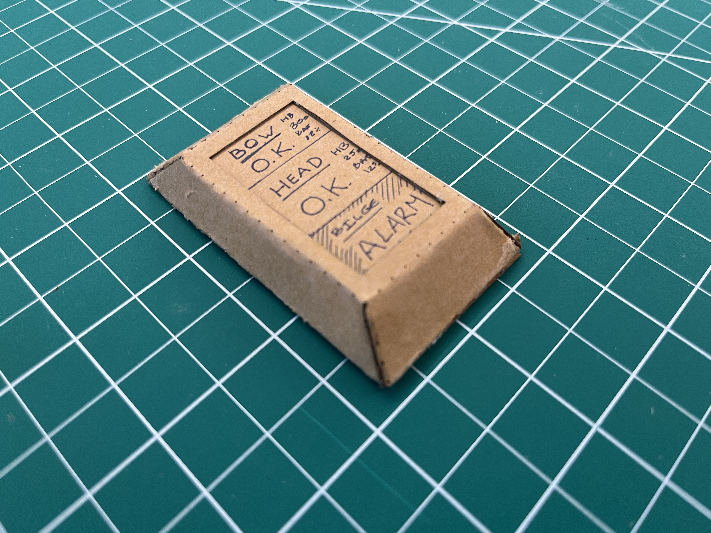

+++
date = '2025-10-07T00:30:43-04:00'
draft = false
title = 'First Prototypes'
tags = ['Project Development']
+++

I've really enjoyed the idea of prototyping as a three-pronged framework. Specifically, placing more weight on aesthetics and sensorial concerns breaks with the patterns of development I'm used to (make, make, make - and make it work).

Building on the quick prototypes that resulted from the class exercise, I first made some attempts at trying to figure out what exactly my "controller", or brain, would look like. This is the central "hub" that acts as the polling station for all connected BLE devices. Initially I thought this would be a large, screen-enabled thing that would allow you to control the whole installation flow of sensors throughout the boat.

But the more I thought about it, the less this made sense for various reasons. The first is that a large screen will only really be useful during install - at all other points, it drains significant power, and the information isn't dynamic enough to justify the size and resolution of a traditional screen. Not only this, but it also increases our processing power requirements, meaning added costs for the project as a whole.

Instead, I played with other directions, in part derived by the work done in class.

This has moved me more in the direction of a smaller central device, that at *most* has a small e-ink screen. The sensors can be paired and configured using a captive portal hosted by the central device. In this way, we get all the benefits of a unified central unit, while not having to stick an enormous screen on it.

The sensors have followed a more cohesive line. If anything, what has changed is the form-factor of the shell and the "sensing" strip, which is what I focused on here. 

I played around with the form factor and size a bit, using thicker stock to fold a small puck-like shell, which I quite liked, though it turned out a bit large.

Instead, the direction I ended up going with resembled a sort of enlarged glucose-sensing monitor. The sensing strip surrounds it, which actually would be an advantage given that we could sandwich the strip with the shell, thus closing off the connections from the elements. The difference in the two designs has to do with the size of the shell and the form factor of the sensing strip.

Eventually, these will have printed traces on them.

This is the smaller version, which I quite like.

## Functional

In terms of the functional prototype, I can mainly speak to the architecture of the system, and what I've accomplished so far.

I spent quite a bit of time familiarizing myself with the ins-and-outs of the bluetooth protocol. My main issue was figuring out how to create acknowledgable back-and-forths between a sensor and the central, while also figuring out a way to conserve as much power as possible.

I discovered that while the default settings on most bluetooth libraries make this impossible, the protocol allows for it by playing with *latency* and *timeout* settings in the context of a *connection*, as distinct from *advertising*. By tweaking these values, we can essentially allow the peripheral to "drop" as many packages as we deem appropriate before it disconnects. This way, despite the maximum timing window between packets being around 4s, we can achieve dormant states of, essentially, indefinite time.

I started playing around with the Bear modules, but ended up going with a couple of Seeed Studio nRF52 modules given how well supported they seemed to be. Seeed puts out a modified Bluefruit library that runs the BLE stack on the little boards, and while it's not well documented, the source is easy to navigate and figure out. It also matches the BLE protocol definition quite well.

I eventually got it working so that my computer, acting as a central, could perpetually scan for peripherals, add them to a local database (a JSON file for now), and poll for updates to a random number generator (0-1), which serves a stand-in for a Leak/No-Leak binary state. There's an interface that allows for naming the sensors, as well as removing them from the system.

At present I'm working on porting this over to a RBPi Zero, so that this interface can be hosted as part of a captive portal. I'm also adding SMS support, so that "leak" states send out messages to the user's phone. 

