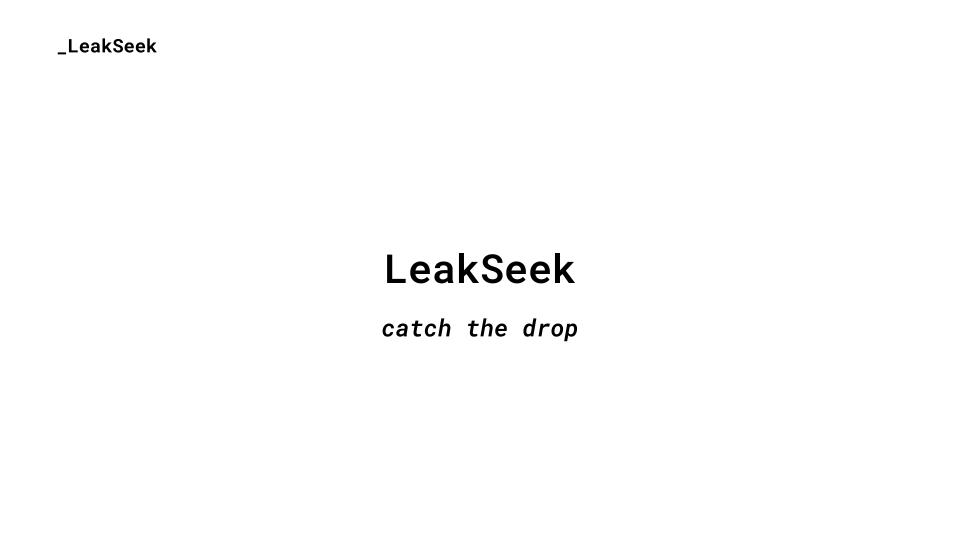
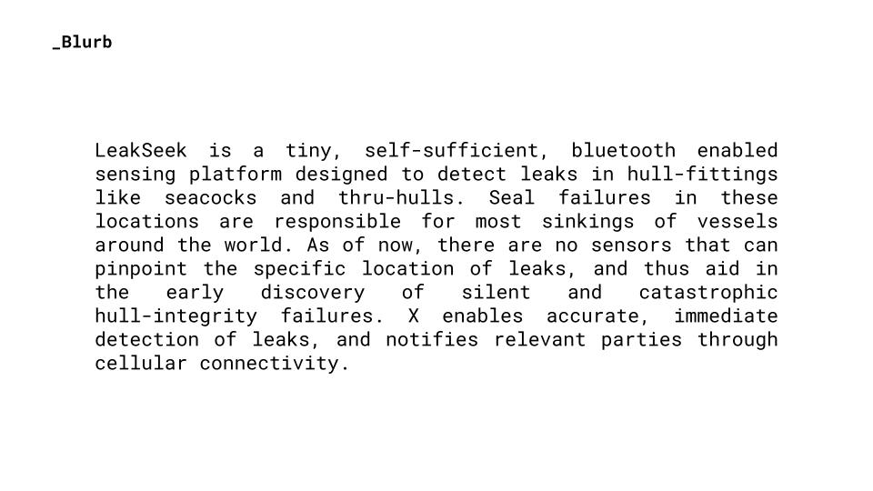
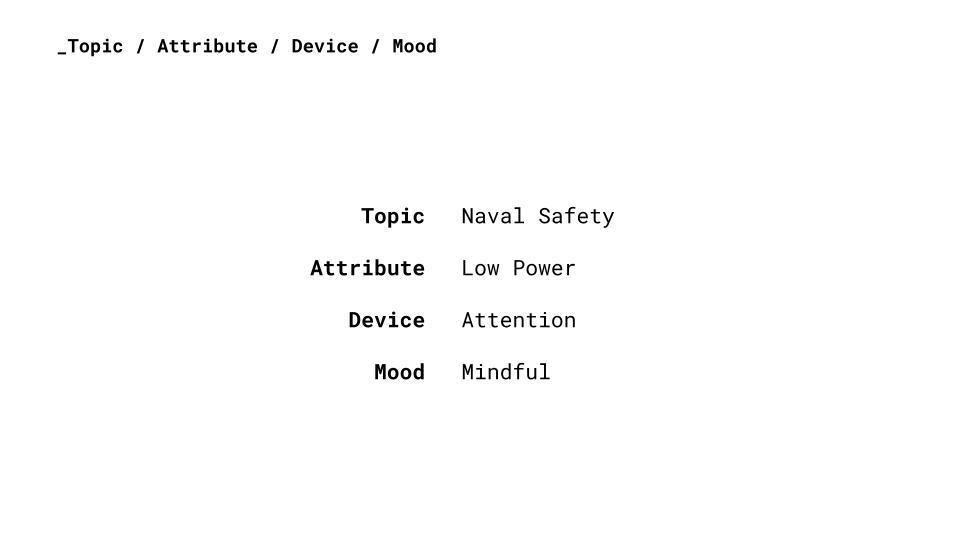
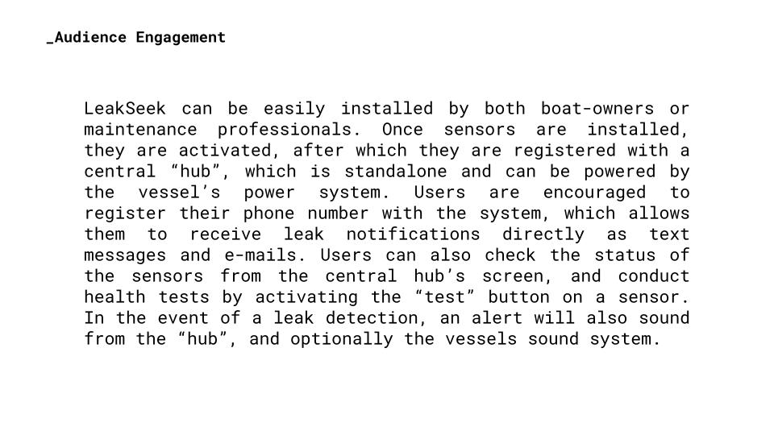
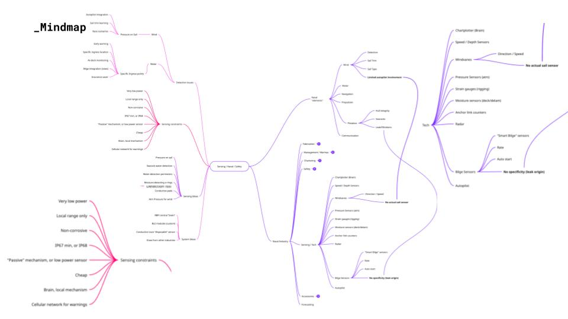
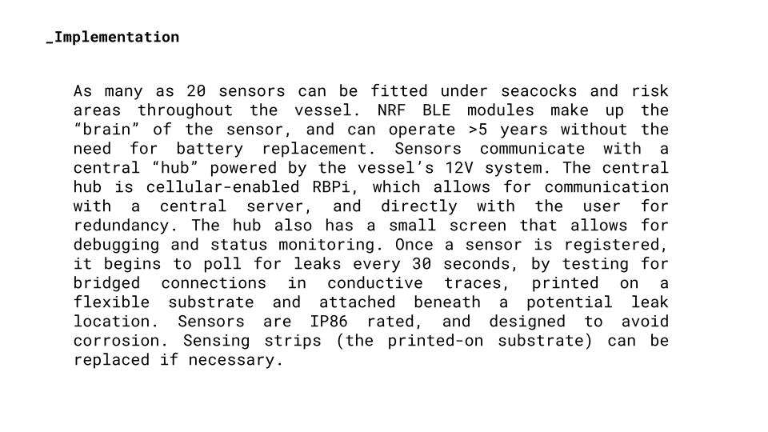
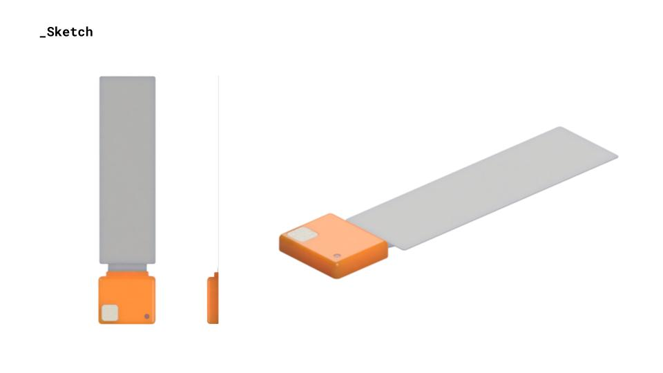
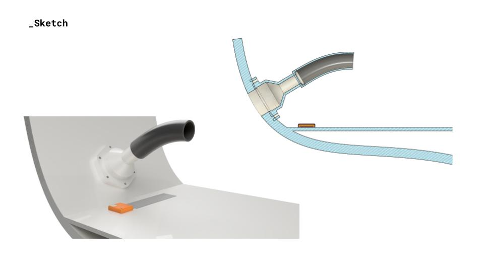
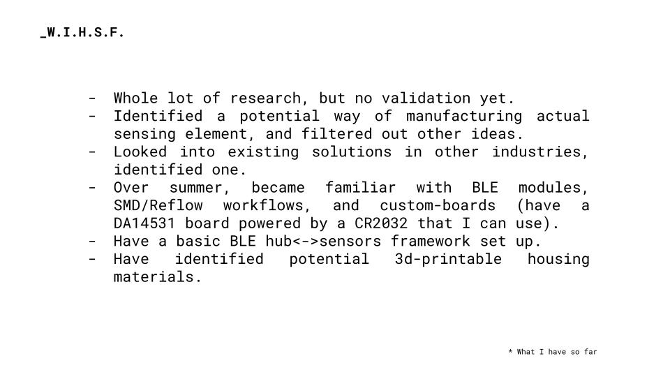
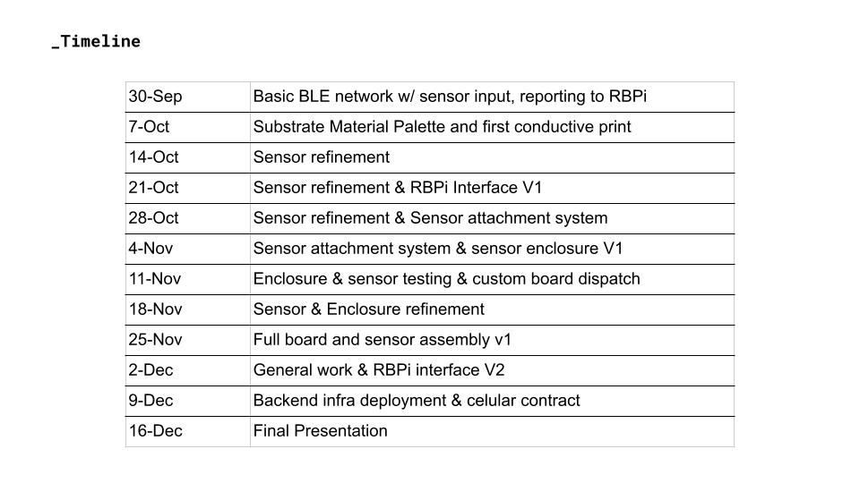

+++
date = '2025-09-23T14:47:28-04:00'
draft = false
title = 'Project_dev_pitch'
tags = ['Project Development']
+++

Pitch presentation: [Presentation](https://docs.google.com/presentation/d/1SIpF3BI09-L0ogFq0cT9UEp7dSEfUjZU98rtA9jb7ro/edit?usp=sharing)

