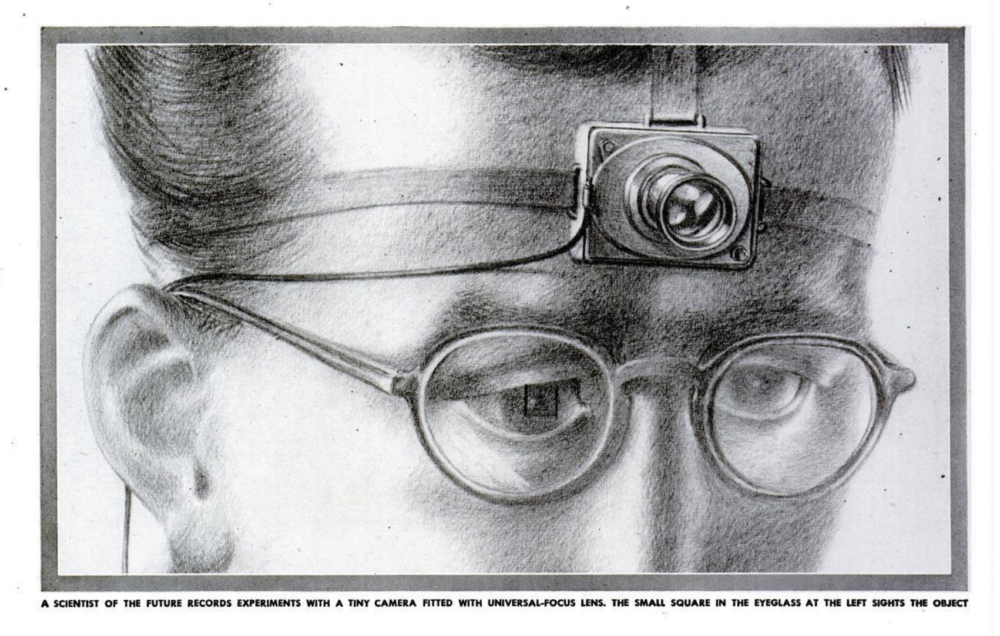

+++
date = '2025-10-05T21:11:35-04:00'
draft = false
title = 'Thesis Update 2'
tags = ['Thesis']
+++

^ From Vannevar Bush's *As We May Think* ^

First, an admission of guilt:

I didn’t get around to reading the sources I’ve compiled. Instead, I’ve dedicated a significant amount of time to gathering and then curating a corpus of prose that I think will carry me through to the end of thesis. I’ve also made it “[public](https://www.notion.so/283a65fcdedf80beb4f0cad5e9944369?pvs=21)”, in that I’ve exported my Zotero database and pasted it into a Notion page for the sake of visibility. Good news is I don’t expect the list to change much in the coming weeks (there’s enough here for many months of reading).

I’ve focused on covering four bases with the resources I’ve compiled:

- Primary sources (1940s-1990s)
- Histories, Compilations, and Articles (1970s-Present)
- Philosophy, Theory (1960s-Present)
- Technical Documents (1940s-1970s)

To recap - there are two “tracks” to my thesis. The first is academic and a bit more heady. I want to become extensively acquainted with the history of “esoteric” computation. By this I mean ideas in computation and Human Computer Interaction that were once thought to be promising, even revolutionary, and yet met a quiet demise when faced with the pressures of industry and bad timing. The second track is entirely practical. I’m working on constructing a system of knowledge and media (text) management that is built on these “forgotten” concepts, facilitated by technical advances over the past 5 years.

The sources I’ve gathered serve the two tracks quite well, I think. On one hand, I can begin a serious survey of these ideas, their history, and their impact, while also drawing on this same material in order to inform my technical choices and the overall architecture of my computational system. Even during an initial review, I’ve found that a lot of the subjects covered by these sources overlap heavily - theories of Cybernetics refer back to Ellulian *technique,* Lisp machines realize the dreams of Vannevar Bush, etc. So I’m optimistic about what this might bring.

I’m also excited to have found sources like Jünger’s *The Failure of Technology,* which despite being written in 1939 (and published with it’s cover featuring a pencil drawing of the Titanic mid-sinking), is a bit more critical about the direction technology might take. This is key for me - most of the sources from these years I’ve come across have a fervent conviction that the technological future will be utopian. Jünger’s introduction already begins to reframe the way I think about technical utopia (a sort of subconscious driver behind a lot of these technologies):

”It could be asked why it is that the machine in particular furnishes so much stuff to the mind of utopian turn. In former times, such a mind found its inspiration in the state, and the book that has given its name to the whole species, Thomas More’s *De optimo republicae statu, deque nova insula Utopia,* was a tale of the state. The changed subject matter reflects a change in the interests of the readers of such tales. Their interest is not aroused by what is accomplished, final, and completely within our grasp; it is satisfied neither with the past nor with the present - it turns to the possibilities of the future; it feeds on what might happen. The utopian tale demands an image capable of rational development and expansion, and the most serviceable image of this nature that can be found today is the machine.”

Regarding Professors to contact:

1. Joerg Blumtritt - Adjunct at ITP, teaches *Politics of Code*. Has a very deep level of technical knowledge, and I was his GA last year. Also has a surprising breadth of philosophical knowledge and its applicability to technology; would be very useful for a lit review.
2. Carl Skelton - Adjunct at Gallatin and IMA. Taught a class called *Making Virtual Sense*, which cites about half of my sources in its description, and has to do with reimagining how we interact with our ideas in virtual environments.
3. [**Laine Nooney](https://steinhardt.nyu.edu/user/3296) -** Associate Prof. at Steinhardt. Taught a class called *History of Computing: How the Computer Became Personal*, which is the only class I’ve found in all of NYU that engages computing from a historical perspective.

I think I’ll start by contacting Joerg, and see where that goes. I want to be a bit farther into the practical side of my thesis before beginning these conversations, and I will likely make an earnest effort to reach out more starting December.