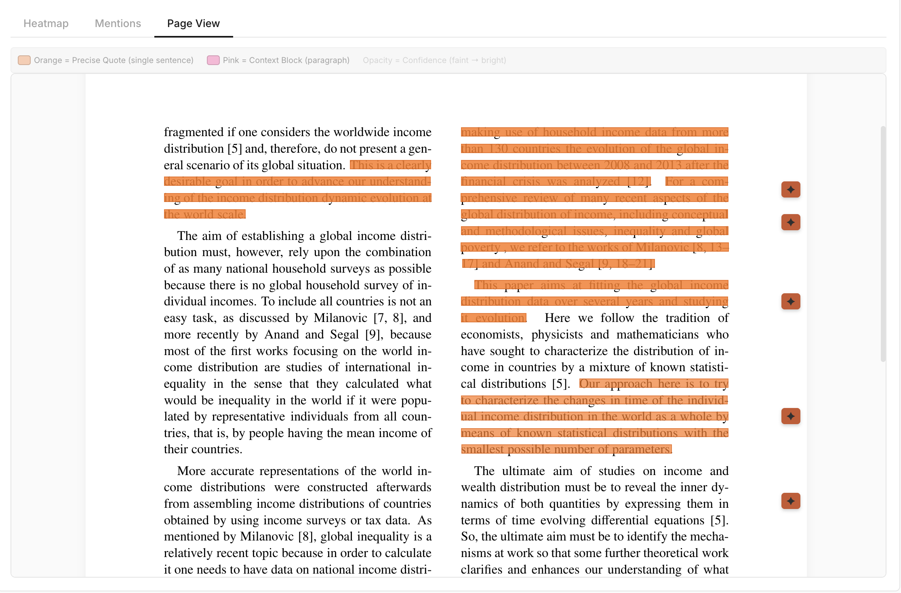
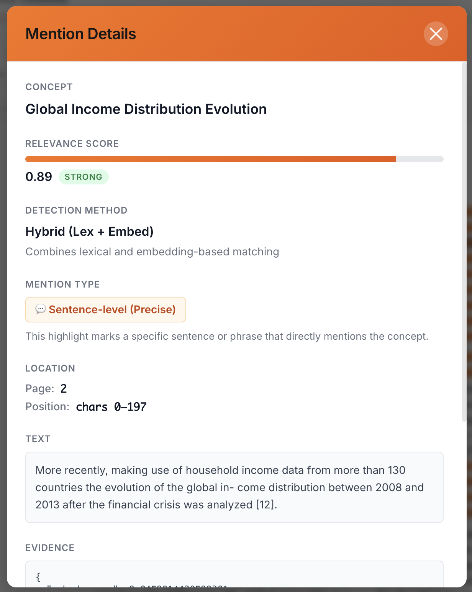
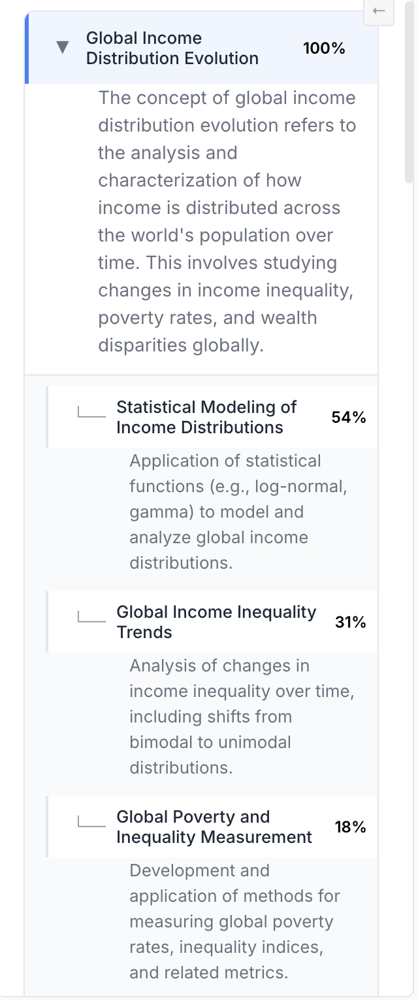
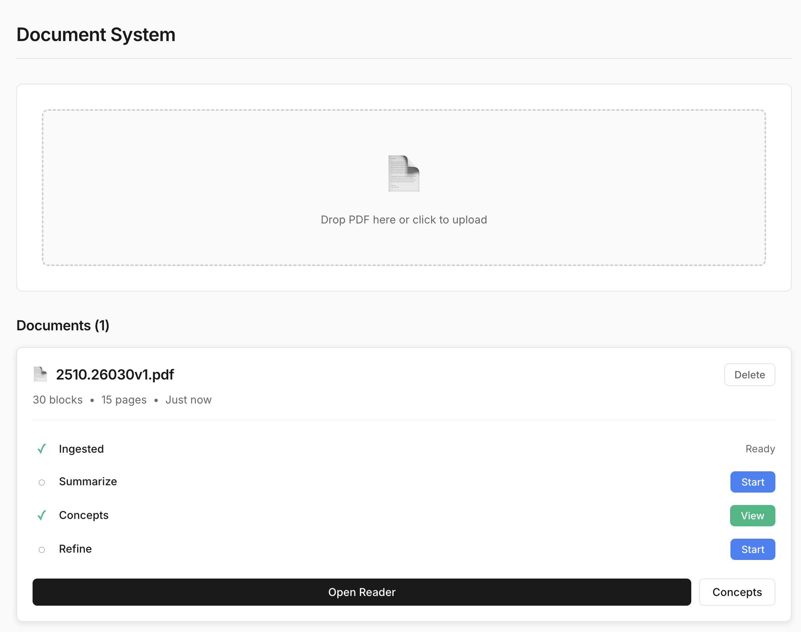

+++
date = '2025-11-03T00:19:53-05:00'
draft = false
title = 'Thesis Making 2'
tags = ['Thesis']
+++

I'll apologize ahead of time for the format of this post. It's a bit more scattered, largely due to a lack of time on my end. Hopefully it'll somewhat illustrate what the past two weeks have been about.

--- NOTES ---

- I received good feedback from the class, and was quite happy that reception to the idea was good (at least judging by the amount of suggestions and directions people seemed to want to take it). In speaking to others about the current "experimental project" (Document-summarizer), a few deeper points came up.

- Amongst those points was a recurring one - to do with the actual utility of the thing. Because, to an extent, while the textual summaries are useful, they also veer into a sort of "shiny but pointless" territory. There's a pretty big leap between reading the raw text of a book and even the first layer of summary, where an AI has taken over the entire task (and thus demands you trust it). People seemed to want a middle-ground.

- I built out different feature, one that instead of summarizing text, extracted the main concepts of a text and presented them neatly to you. It then backs up those concepts with sentences that can be navigated to throughout the text. This has proved a very interesting addition: LLM's turn out to be fantastic at extracting complex meaning from text, and implementing the "evidence" system was a very interesting technical challenge.

- I took a detour into OCR frameworks, and discovered a very fertile world (conceptually) where computers stubbornly refuse to understand textual structure and design. There might be something here to explore.

- I also built out a more graphical interface for this conceptual extraction, aggregating everything in a heatmap that intuitively points out what areas of the text contain a given concept.

- I've also spent quite a bit of time researching adjacent technologies, like RAG and embeddings models. I think I'm steadily working towards creating a technical "core" that I can apply to multiple types of projects. I also think I've defined a method that will allow me to do that, and will hopefully expand on the ability of embeddings to simulate memory when it comes to information retrieval.

- That secondary project has to do with using LLM's to create very strictly parametrized metadata, therefore allowing for the creation of knowledge "graphs" by using that metadata to connect distinct (but shared) units of meaning. This essentially allows for nuanced contexts within an embeddings system, which I think is an interesting research direction. I'm going to start building this out as I refine the other project prototype.

