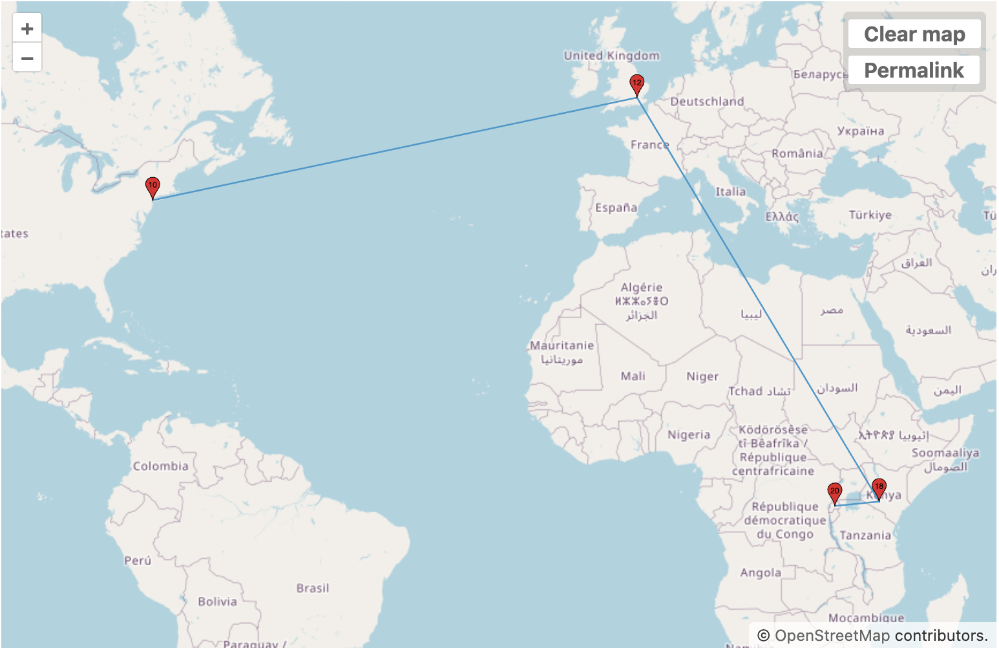
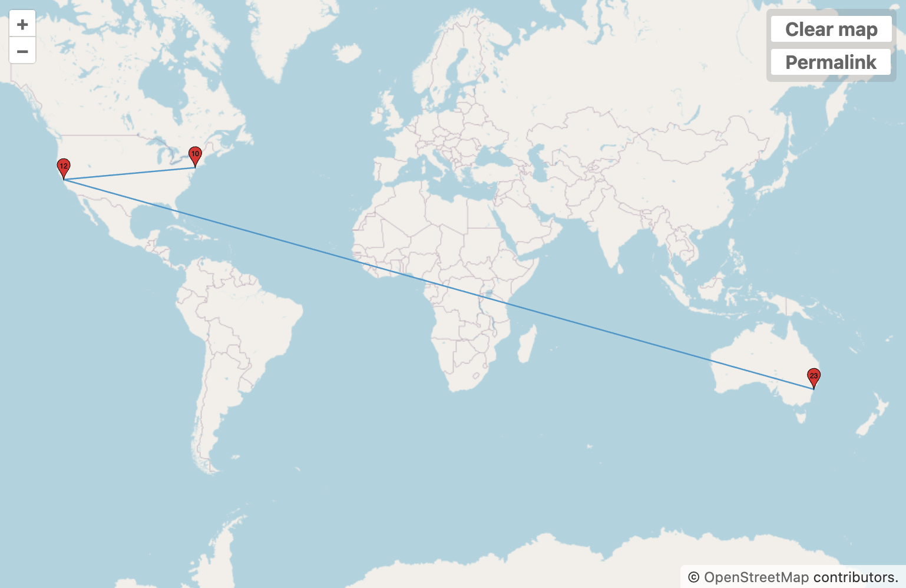

+++
date = '2025-09-11T23:05:59-04:00'
draft = false
title = 'Traceroute'
tags = ['Understanding Networks']
+++

Traceroute allows us to see the path a packet takes from our computer to the requested host server. Inspecting a traceroute can give us powerful clues as to the structure of the network that surrounds us, and our location within it.

I chose to use **mkr** throughout these explorations, namely because it's fun to watch (it dynamically updates latency values as it attempts, a default of 10 times, to ping a given server on the path to our target). It also has some nice affordances around saving data to json files, as well as reading from a `hosts` text file (making it easy to list out a number of addresses we might want to try without doing it manually).

## Finding ^high^ hops!

Probably the first thought to entertain is "I wonder what the largest number of hops I can get is...". 

Turns out, (at least for me), the winners are the **Rwanda and Vanuatu** government websites, with 24 hops each. The logic here is that these are locally served sites (no large CDNs like Cloudflare) in fairly "remote" places, requiring complex navigation to get to. That said, it's still *insane* that we can get pretty much anywhere on earth in just 20 hops.

Here's a pair of maps, the first for the Rwandan site and the second for the Vanuatu site:




Other sites of note are:

`egov.sc` - 16 hops - Seychelles

`presidence.gov.bi` - 16 hops - Burundi

`github.com` - 13 hops w/ tcp 443 - Github!

`reuters.com` - 13 hops w/ tcp 443 - Reuters!

`emol.com` - 12 hops - Chilean news site I read in the mornings

`kiribati.gov.ki` - 10 hops - Kiribati

You'll notice that some sites, like `Github`, display oddly large numbers of hops using a `tcp 443` protocol. The logic for this, apparently, is that servers will often ignore or de-prioritize ICMP requests, essentially making hops "invisible", thus resulting in artificially low numbers. 443 is the standard HTTPS port, and thus it is more likely that servers will respond in kind - often these packets will be routed differently because of this.

Also of note is that we can usually identify hops in-and-out of AS's by sharp increases in latency from one hop measure to another.

In making a traceroute to `emol.com`, located in Chile, the hop from `Level 3 Parent, LLC` (our "gateway" AS) to `Cirion` (AS in Latam) takes about 105ms. What's interesting is that in the `emol.com` case, there's a jump from `Level 3` to `Cirion` and then *back* to `Level 3` before jumping to the final AS (`Telmex Chile`). I can only presume there's a bottleneck somewhere in Cirion, or Level 3 actually manages bridge-infrastructure between Cirion and Telmex, which is something I'll investigate further.

## Interesting things close to home

It seems like every request I make out of the NYU network has to pass through `Level 3 Parent, LLC` (AS3356). Presumably the NYU network is directly tied to `Level 3`, and as such acts as the entrypoint into the wider web.

Another interesting AS I found is the one belonging to `NYSERNET` (AS3629). This one popped up while making a `traceroute` for `google.com`. It turns out that NYSernet is a fairly old non-profit, which also was the first commercial ISP in the United States! They were also the first to set up a proper network outside of the DoD (or at least they claim). Still, very cool to find these rich histories hidden behind a terminal.

I found it curious that on the edge of the NYU network we always find domains like: `extgwa-dmzgwc.net.nyu.edu`. I looked around a bit, and it seems like the subdomain naming convention is fairly common, and refers to specific interfaces and how they're connected. In this case, `extgwa-dmzgwc` might refer to:

extgw[a|b|c] = external gateway [A/B/C]

dmzgw[a|b|c] = DMZ gateway [A/B/C]

dash between names = point‑to‑point link naming convention (routerA–routerB), sometimes with interface suffixes (e.g., eth11-1 ↔ eth7-1)

I asked an LLM for a bit of help defining what `external gateway` and `DMZ` might mean in this context; here's Claude's answer:

"External gateway (extgwX): campus edge router/firewall pair that peers with ISPs/CDNs (eBGP), does border ACL/NAT/policy, and originates your default route. It’s the handoff from NYU to external ASes.

DMZ gateway (dmzgwX): firewall/router facing the DMZ VLANs. It’s the L3 gateway for public-facing services (reverse proxies, mail relays, VPN portals, etc.), enforcing policies between campus/core and the DMZ. It is not “internal open”; it’s semi‑trusted and more tightly filtered from the Inside than the Outside is.

DMZ (demilitarized zone): segregated subnet(s) specifically for systems exposed to the Internet. Inbound from Internet to DMZ is allowed per policy; DMZ to Inside is very limited; Inside to DMZ is controlled."

## Implementing RAND Networks in Elixir/Erlang

I can't understate how *fascinating* I find the RAND Networks paper. I'm very surprised at how simple the fundamental pathfinding algorithm is - the combination of "hot potato" with the routing table tracking hops across nodes. It's incredibly simple yet manages to effortlessly encompass the surreal complexity of tracking and operating a self-healing system.

I have a long working history with Elixir (a modern offshoot of Erlang). One of the beauties of Erlang is that it allows us to create thousands of lightweight, managed, concurrent processes that excell at message-passing (it was developed as a telephone-switching platform after all). It occurred to me that this would make modelling the famous RAND "mesh" network described in the paper a fairly easy project, and I could get the pleasure of running my own traceroute against my little network. 

### Basic Structure

Every process we spawn in Elixir gives us a `pid` that we can use to call it. Because processes automatically implement mailboxes (queues) for messages, we don't need to worry about handling FIFO queues for each entity we create (truly, Elixir is probably the most "sane" language I've ever worked with). 

The RAND paper is quite clear about the structure of a Node:

```code
NODE -> PROCESSOR + INTERFACE
INTERFACE -> NETWORK_CARD | INTERFACE + NETWORK CARD
```

Where a `NETWORK_CARD` (my language) is nothing more than the actual hardware connector to another node. A `PROCESSOR` in this case is understood as the Node process that receives a `PACKET` and "hot-potatoes" it to another `NODE` based on the network table (or randomly if the other `NODE` is unknown).

Therefore, in order to simulate this structure in Elixir, we create the following mapping:

```code
NODE -> GenServer + INTERFACE
INTERFACE -> Agent | INTERFACE + Agent
```

We create a series of `GenServers` which will act as our `NODE`s, in that they will: a) own a series of "interfaces" (smaller, Agent processes) & b) hold state for routing. On creation, 4 network "cards" (`INTERFACES`) are created per `NODE`, and interconnected randomly (while disallowing repeat connections) - these are then assigned to each of the X number of `NODE`s we wish to create; in this way, we simulate the creation of a mesh network as specified in the RAND paper (a series of `NODES`, all interconnected, with no "central" nodes).

We can also create a rudimentary `PACKET` to simulate the `1024`-bit packet the paper suggests.

```elixir
    bits =
      <<byte_size(from_bin)::16, from_bin::binary,
        byte_size(to_bin)::16, to_bin::binary,
        hops::16, ttl::16,
        byte_size(ack_bin)::16, ack_bin::binary, byte_size(payload)::16,
        payload::binary>>

    %Packet{bits: bits}
```

Of note is that nowadays `hops` is replaced by the concept of TTL entirely, which counts down as it passes through routers - when it gets to 0, the packet is discarded to avoid forever loops. Routers use far more sophisticated ways of path-finding than the RAND hop-table, although conceptually I find the RAND table more elegant.

At this point our basic structure is done.

### Node logic

Our `NODE`s hold the following logic:

```elixir
    state = %{
      name: self(),
      node_map: %{},
      # List of pids of HardwareLink processes
      interface_pids: network_interface_pids
    }
```

As we receive `PACKET`s from the `HARDWARE_LINK` Agents, we add these to our `node_map`, which is just a `Map` representation of the hop-table suggested in the RAND paper. Because Elixir allows *anything* to be a `Map` key, we can easily implement a table like so:

```elixir
node_map = %{{node_pid, local_hardware_pid} => hop_count, ...}
```

Then, when looking to route a `PACKET`, we can look up the equivalent pairing in our `node_map`. If the pairing doesn't exist, we "hot potato" the `PACKET` out of another `HARDWARE_LINK`.

The basic logic is encompassed in the following `handle_call` callback in our `NODE` GenServer:

```elixir
  @impl true
  def handle_call({:incoming_packet, packet}, from_local_interface_pid, state) do
     %{
      from_node: from_node_pid,
      to_node: to_node_pid,
      hops: hops,
      message: _message,
      ack_to: ack_to,
      ttl: ttl #defaults do 64
    } =
      parse_packet(packet)

    state = update_node_map(state, from_node_pid, from_local_interface_pid, hops + 1)

    if hops >= ttl do
      {:reply, :ok, state} # kill the packet by killing the GenServer state loop
    else
```

Here we parse our incoming packet, extracting usable information from our 1024 bits, including:
**hops** - how many nodes we've jumped through on our way here.
**ttl** - we incorporate a ttl value into the packet so we don't end up in weird loops on the way to the destination.
**ack_to** - I've also added an `ack_to` mechanism, where the receiving node returns an `ACK` packet to the sender. This helps with route discovery, as intermediate nodes now know how to route "from" and "to" endpoints, instead of just blindly sending the package forwards.

```elixir
    if is_this_node?(to_node_pid) do
      # The traceroute function will create a Packet that incorporates a trace
      # tuple as its message - {{:trace, list_of_addresses}, {:payload, payload}}.
      # As the packet passes through the nodes, we append an address to the trace list.
      annotated = annotate_trace(packet, state)

      # We parse the packet to get the message and extract the payload (granted there's a bit of
      # duplication here we should get rid of).
      #TODO: get rid of this duplication, parsing three times by now is idiotic.
      parsed_for_ack = parse_packet(annotated)
      IO.puts("Message reached destination: #{inspect(parsed_for_ack)}")

      if ack_to do
        # This is hacky, but we essentially bypass the whole node mesh and 
        # send the confirmation back to the original process that requested the traceroute.
        send(ack_to, {:delivered, self(), hops, parsed_for_ack})
      end

      # We route the ACK back to the source node so it can learn the distance to us, if ack_to is present.
      maybe_route_ack(parsed_for_ack, state)

      {:reply, :ok, state}
    else
      # Otherwise, we forward the packet to the next node in the mesh.
      # This function will check to see if an interface is busy, and if so, it will try the next best route.
      # If no route is found, it will send the packet out of a random link.
      try_forward_with_retry(state, to_node_pid, from_local_interface_pid, packet)

      {:reply, :ok, state}
    end
```

This is the real core of the logic, annotated as clearly as possible. Essentially, we check to see if the packet was intended for us. If it it was, we also check whether we're requesting an `ack`, in which case we'll send back an `ack` package through the network. Alternatively, we attempt to forward the packet, which involves checking if the node we're attempting to send to is busy, and if so, retrying via a interface (that, importantly, differs from the one we received our packet through).

### Interface Logic

The model here is that a `NODE` must have a given amount of `INTERFACES`. These can be thought of as "network cards" or the like, which are directly connected to a peer interface. This allows a single `NODE` to carry many 1-to-1 connections to other nodes, and keeps our model consistent with how a theoretical RAND network would operate.

In order to achieve this, I'm using `Agents` as symbolic network interfaces. When a `NODE` (GenServer) decides it wants to transmit a packet, it sends it to one of the `Agents` it owns. Conversely, when an `Agent` receives a packet, it sends it back up to its owner (GenServer). 

An `INTERFACE` (Agent) looks like this in code:

```elixir
    # The initial value should be a map with keys :owner and :paired_link
    # :owner is the pid of the Node that owns this HardwareLink
    # :peer_interface is the pid of the HardwareLink that this HardwareLink is connected to
    def start_link(%{:owner => _owner, :peer_interface => _link} = state) do
        # Initial values are empty; they will be allocated in a round-robin and
        # then paired to a Node.
        Agent.start_link(fn -> state end)
    end
```

Our initial state, then, contains the values `:owner`, and `:peer_interface`, each of which describes its connected "hardware" peer, and `Node` owner.

When a `NODE` decides it wants to transmit a packet, it calls one of its "hardware links" in order to do so. We `spawn` a process instead of calling it directly in order to avoid blocking the loop and running into deadlocks (not as relevant with a simple traceroute, but still good manners).

```elixir
    @spec forward_packet(pid(), any()) :: :ok
    def forward_packet(interface_pid, packet) do
        spawn(fn -> HardwareLink.transmit_packet(interface_pid, packet) end)   
        :ok
    end
```

Inside our actual "hardware", the following function handles an attempt at transmission:

```elixir
     @spec try_transmit(pid(), Packet.t()) :: :ok | :busy | :no_peer
  def try_transmit(local_interface_pid, packet) do
    # Check if there is a peer interface (get its pid)
    peer_interface_pid =
      Agent.get(local_interface_pid, fn state ->
        Map.get(state, :peer_interface)
      end)

    if is_nil(peer_interface_pid) do
      # No peer interface registered, bad luck
      :no_peer
    else
      # Check if we are busy by simulating a random probability
      busy_prob = Agent.get(local_interface_pid, fn state -> Map.get(state, :busy_prob, 0.0) end)

      if :rand.uniform() < busy_prob do
        # Oops, we are busy
        :busy
      else
        # Not busy, try to send the packet to the peer's owner
        # Importantly, this call is synchronous, so if the peer's owner is busy,
        # this will block until it can be processed. TODO: figure out if async is possible by implementing a GenServer
        # That said, it is OK with our model, in that the peer interface handles the actual passing and remote call.
        Agent.get(peer_interface_pid, fn peer_state ->
          case Map.get(peer_state, :owner) do
            nil ->
              :no_peer

            peer ->
              RAND.Node.push_packet(peer, packet)
              :ok
          end
        end)
      end
    end
  end
```

The packet is "passed" in that the peer `Agent` is prompted to receive and pass the appropriate call to its owner `Node`.

In the future, it might make sense to also make this a `GenServer` or a bare `Erlang` process and implement an actual "mailbox" for our interfaces as well; `Agents` are only naive processes and are not quite suited to message-passing.

## Setting Up

Our system is spawned by specifying a number of nodes and a number of interfaces per node, and then tying these interfaces together, ensuring that interfaces are only tied to external nodes.

```elixir
def spawn_network(num_nodes, interfaces_per_node)
      when num_nodes > 1 and interfaces_per_node > 0 do
    # 1) Create all hardware links (one per interface)
    total_links = num_nodes * interfaces_per_node

    link_pids =
      for _ <- 1..total_links do
        {:ok, pid} = HardwareLink.start_link(%{owner: nil, peer_interface: nil})
        pid
      end

    # 2) Group interfaces per node
    interface_groups = Enum.chunk_every(link_pids, interfaces_per_node)

    # 3) Start nodes with their interface lists and register ownership
    node_pids =
      for iface_list <- interface_groups do
        {:ok, node_pid} = RAND.Node.start_link(iface_list)
        Enum.each(iface_list, fn iface -> HardwareLink.register_owner(iface, node_pid) end)
        node_pid
      end

    # 4) Connect interfaces randomly, avoiding same-owner connections
    # We'll create a pool of all interfaces and pair them up with constraints.
    # Simple greedy pairing: repeatedly pick an interface and try to find a peer from a different owner.
    :ok = randomly_pair_interfaces(interface_groups)

    # 5) Assign simple word addresses and register them on nodes
    addresses = generate_addresses(length(node_pids))

    Enum.zip(node_pids, addresses)
    |> Enum.each(fn {pid, addr} -> RAND.Node.register_address(pid, addr) end)

    {node_pids, List.flatten(interface_groups)}
  end
```

This function will return a list of nodes which we can then run operations on, like a traceroute.

## Traceroute

Finally, we can run the equivalent of a traceroute on our node network. The following procedure shows roughly how that works, using the `iex` shell process.

We first spawn our network, in this case, 200 `NODES` with 3 `INTERFACES` per each node.
```elixir
{nodes, _} = RAND.spawn_network(200, 3)
```

We can list out a directory for these nodes - each node is assigned an `idx` and a `name` in our network (I guess the analogy here would be **ip** and **domain**), where the registry would be a rudimentary DNS.

```elixir
iex(2)> RAND.directory(nodes)
[
  {0, "golden-fox-4857"},
  {1, "amber-mesh-6913"},
  {2, "slow-field-5037"},
  {3, "bright-node-1225"},
  {4, "golden-stream-8640"},
  {5, "slow-river-7359"},
  {6, "golden-link-7880"},
  {7, "bright-river-4209"},
  {8, "green-link-6743"},
  {9, "loud-mesh-6896"},
  ...
]
```

Finally, we can run a traceroute form one node to another. Let's try a series of "naive" traceroutes from node 1 to node 83. Note that `ack_to` in these packets is a reference to the calling process (in this case, our shell), not a Node.

```elixir
iex(3)> RAND.traceroute(nodes, 1, 83, "hello", timeout: 2000)
Message reached destination: %{message: "hello", ttl: 64, from_node: #PID<0.752.0>, to_node: #PID<0.834.0>, hops: 8, ack_to: #PID<0.150.0>}
{:ok, 8}
iex(4)> RAND.traceroute(nodes, 1, 83, "hello", timeout: 2000)
:timeout
iex(5)> RAND.traceroute(nodes, 1, 83, "hello", timeout: 2000)
Message reached destination: %{message: "hello", ttl: 64, from_node: #PID<0.752.0>, to_node: #PID<0.834.0>, hops: 58, ack_to: #PID<0.150.0>}
{:ok, 58}
```

Notice that the number of hops varies quite a bit, even giving us timeouts occasionally. This is because our hop tables only know data in a to -> from direction. Sending data again and again in this same direction will not result in a better result; each node knows information about the "past" of the route, and would only be able to use it when sending a message *back* to the original sender. Therefore, the routes don't improve - the message makes it, but that's about it.  

```elixir
iex(6)> RAND.traceroute(nodes, 83, 1, "hello", timeout: 2000)
Message reached destination: %{message: "hello", ttl: 64, from_node: #PID<0.834.0>, to_node: #PID<0.752.0>, hops: 5, ack_to: #PID<0.150.0>}
{:ok, 5}
```

We can look at a more detailed traceroute by using `verbose: true`

```elixir
iex(11)> RAND.traceroute(nodes, 83, 1, "hello", timeout: 2000, verbose: true)
Message reached destination: %{message: {:trace, ["silver-field-5861", "dark-cloud-3951", "bright-mesh-8170", "golden-river-6804", "amber-stream-1576", "silver-river-1567"], "hello"}, ttl: 64, from_node: #PID<0.834.0>, to_node: #PID<0.752.0>, hops: 5, ack_to: #PID<0.150.0>}
traceroute to silver-river-1567 from bright-wolf-8599, 5 hops max
 1	silver-field-5861
 2	dark-cloud-3951
 3	bright-mesh-8170
 4	golden-river-6804
 5	amber-stream-1576
 6	silver-river-1567
{:ok, 5}
```

On the way back, the story is a very different one - all of a sudden, we get a much more efficient route. This is because the efficiency of these hops *is*, to a degree, encoded in the system. We could accelerate this process in future routes by passing `ack_route: true` to our traceroute, which would make it so that on receipt of a packet, the endpoint sends *back* an acknowledgment packet, thus creating a full-path of information for all hop-tables in all the relevant nodes.

## Calcification

Interestingly, one major downside of the hop-table paradigm is what I'm terming the "calcification" of the route. By this I mean that once a route is established, it'll never really change, no matter how many messages you send. The route is "calcified", in part because there's no situation that would cause any alternate route to be taken from one node to another - they're "perfect" after all, so there's never any downtime, or latency, or blocking.

In order to fix this we need to introduce the concept of a "busy" node, and assign each node a probability of being "busy" at any given time. Doing this means that, on occasion, we have to retry a packet send to a random, unknown node, thus causing a new route to be drawn (and hop tables to be refreshed).

Let's see what happens when we introduce this probability into a traceroute call, after making the same call a couple of times to illustrate a calcified route:

```elixir
iex(13)> RAND.traceroute(nodes, 83, 1, "hello", timeout: 2000)
Message reached destination: %{message: "hello", ttl: 64, from_node: #PID<0.834.0>, to_node: #PID<0.752.0>, hops: 5, ack_to: #PID<0.150.0>}
{:ok, 5}
iex(14)> RAND.traceroute(nodes, 83, 1, "hello", timeout: 2000)
Message reached destination: %{message: "hello", ttl: 64, from_node: #PID<0.834.0>, to_node: #PID<0.752.0>, hops: 5, ack_to: #PID<0.150.0>}
{:ok, 5}
iex(15)> RAND.traceroute(nodes, 83, 1, "hello", timeout: 2000)
Message reached destination: %{message: "hello", ttl: 64, from_node: #PID<0.834.0>, to_node: #PID<0.752.0>, hops: 5, ack_to: #PID<0.150.0>}
{:ok, 5}
iex(16)> RAND.traceroute(nodes, 83, 1, "hello", timeout: 2000, busy_prob: 0.05)
Message reached destination: %{message: "hello", ttl: 64, from_node: #PID<0.834.0>, to_node: #PID<0.752.0>, hops: 31, ack_to: #PID<0.150.0>}
{:ok, 31}
iex(17)> RAND.traceroute(nodes, 83, 1, "hello", timeout: 2000, busy_prob: 0.05)
Message reached destination: %{message: "hello", ttl: 64, from_node: #PID<0.834.0>, to_node: #PID<0.752.0>, hops: 5, ack_to: #PID<0.150.0>}
{:ok, 5}
iex(18)> RAND.traceroute(nodes, 83, 1, "hello", timeout: 2000, busy_prob: 0.05)
Message reached destination: %{message: "hello", ttl: 64, from_node: #PID<0.834.0>, to_node: #PID<0.752.0>, hops: 12, ack_to: #PID<0.150.0>}
{:ok, 12}
iex(19)> RAND.traceroute(nodes, 83, 1, "hello", timeout: 2000, busy_prob: 0.05)
Message reached destination: %{message: "hello", ttl: 64, from_node: #PID<0.834.0>, to_node: #PID<0.752.0>, hops: 5, ack_to: #PID<0.150.0>}
{:ok, 5}
```

Granted, it because our establishing trace (not shown above) was issued with a `ack_route: true`, the path encoded in the hope tables is already the most efficient. Adding the `busy_prob` shows us that the system can fairly quickly adapt to outages in the network, and return to the "best path" whenever the ideal nodes are back online.

## Remarks

Other than having an excuse to dip into Elixir after many years, this implementation highlights a series of concepts that I think are worth noting. The first is that these "resilient" systems are not particularly intelligent - they can operate quite well on fairly basic algorithms, and can thus be quite cheap to set up and deploy. It proves to me that a lot of the barrier-of-entry into these concepts is to do with nomenclature more than the complexity of the concepts themselves. Even the distinctions between "hardware" and "software" layers become quite easily understood when represented in a system like this one.

It also highlights just how accessible it is to develop new or custom networking protocols. In my case, I'm leaning quite heavily on the affordances provided by Erlang and Elixir, but the point still stands. The true difficulty is standardization and distribution - while the systems might be easy to implement, they're far from easy to distribute. Compliance cannot always be enforced, which I think is, ultimately, the beauty of networked systems like the Internet; as much as we want to make them about technical accomplishment, they're actually the best revindication of what human society can (and perhaps should) be.

This might've been a bit too long of a wormhole to go down, but I'm hoping I can use this system as a way of mocking up a lot of the concepts we'll look at during the class.

Repo for the code can be found [here](https://github.com/nikokozak/RAND_Network)